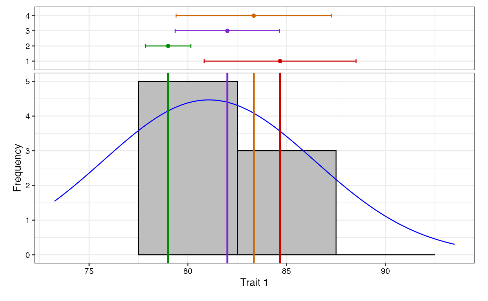
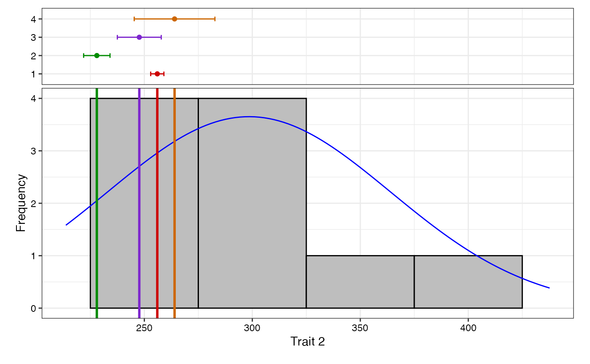
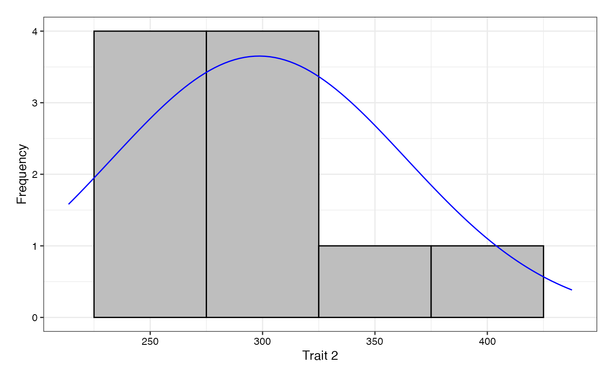
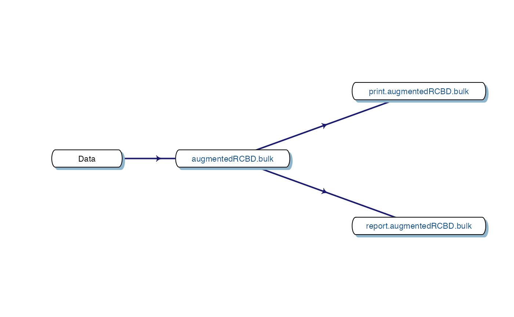

# Data Analysis with \`augmentedRCBD\`

1.  Division of Germplasm Conservation, ICAR-National Bureau of Plant
    Genetic Resources, New Delhi.

&nbsp;

2.  Division of Genetics, ICAR-Indian Agricultural Research Institute,
    New Delhi.

&nbsp;

3.  Division of Genomic Resources, ICAR-National Bureau of Plant Genetic
    Resources, New Delhi.

&nbsp;

4.  Division of Germplasm Evaluation, ICAR-National Bureau of Plant
    Genetic Resources, New Delhi.


## 1 Overview

The software `augmentedRCBD` is built on the [`R` statistical
programming
language](https://en.wikipedia.org/wiki/R_(programming_language)) as an
add-on (or ‘package’ in the `R` *lingua franca*). It performs the
analysis of data generated from experiments in augmented randomised
complete block design according to Federer, W.T.
([1956a](#ref-federer_augmented_1956),
[1956b](#ref-federer_augmented_1956-1),
[1961](#ref-federer_augmented_1961);
[1976](#ref-federerModelConsiderationsVariance1976)). It also computes
analysis of variance, adjusted means, descriptive statistics, genetic
variability statistics etc. and includes options for data visualization
and report generation.

This tutorial aims to educate the users in utilising this package for
performing such analysis. Utilising `augmentedRCBD` for data analysis
requires a basic knowledge of `R` programming language. However, as many
of the intended end-users may not be familiar with `R`, [sections 2 to
4](#rsoft) give a ‘gentle’ introduction to `R`, especially those aspects
which are necessary to get `augmentedRCBD` up and running for performing
data analysis in a Windows environment. Users already familiar with `R`
can feel free to skip to [section 5](#install).


## 2 `R` software

It is a free software environment for statistical computing and
graphics. It is free and open source, platform independent (works on
Linux, Windows or MacOS), very flexible, comprehensive with robust
interfaces for all the popular programming languages as well as
databases. It is strengthened by its diverse library of add-on packages
extending its ability as well as the incredible community support. It is
one of the most popular tools being used in academia today ([Tippmann,
2015](#ref-tippmann_programming_2015)).

## 3 Getting Started

This section details the steps required to set up the `R` programming
environment under a third-party interface called `RStudio` in Windows.

### 3.1 Installing `R`

Download and install `R` for Windows from
<http://cran.r-project.org/bin/windows/base/>.


**Fig. 1**: The `R` download location.

### 3.2 Installing `RStudio`

The basic [command line
interface](https://en.wikipedia.org/wiki/Command_line_interface) in
native `R` is rather limiting. There are several interfaces which
enhance it’s functionality and ease of use,
[`RStudio`](https://www.rstudio.com/) being one of the most popular
among `R` programmers.

Download and install `RStudio` for Windows from
<https://www.rstudio.com/products/rstudio/download/#download>


**Fig. 2**: The `RStudio` download location.

### 3.3 The `RStudio` Interface

On opening `RStudio`, the default interface with four panes/windows is
visible as follows. Few panes have different tabs.


**Fig. 3**: The default `RStudio` interface with the four panes.

#### 3.3.1 Console

This is where the action happens. Here any authentic `R` code typed
after the ‘`>`’ prompt will be executed after pressing ‘Enter’ to
generate the output.

For example, type `1+1` in the console and press ‘Enter’.

``` r
1+1
```

    [1] 2

#### 3.3.2 Source

This is where `R` Scripts (collection of code) can be created and
edited. `R` scripts are text files with a `.R` extension. `R` Code for
analysis can be typed and saved in such `R` scripts. New scripts can be
opened by clicking ‘File\|New File’ and selecting ‘R Script’. Code can
be selected from `R` Scripts and sent to console for evaluation by
clicking ‘Run’ on the ‘Source’ pane or by pressing ‘Ctrl + Enter’.

#### 3.3.3 Environment\|History\|Connections

The ‘Environment’ tab shows the list of all the ‘objects’ (see [section
4.3](#ObjFun)) defined in the current `R` session. It has also some
buttons up top to open, save and clear the environment as well as few
options for import of data under `Import Dataset`.

The ‘History’ tab shows a history of all the code that was previously
evaluated. This is useful, if you want to go back to some code.

The ‘Connections’ tab helps to establish and manage connections with
different databases and data sources.

#### 3.3.4 Files\|Plots\|Packages\|Help\|Viewer

The ‘Files’ tab shows a sleek file browser to access the file directory
in the computer with options to manage the working directory (see
[section 4.1](#wdir)) under the More button.

The ‘Plots’ tab shows all the plots generated in `R` with buttons to
delete unnecessary ones and export useful ones as a pdf file or as an
image file.

The ‘Packages’ tab shows a list of all the `R` add-on packages
installed. The check box on the left shows whether they are loaded or
not. There are also buttons to install and update `R` packages.

The ‘Viewer’ tab shows any web content output generated by an `R` code.

## 4 Some Basics

This section describes some basics to enable the users to have a working
knowledge in `R` in order to use `augmentedRCBD`.

### 4.1 Working Directory

It is a file path to a folder on the computer which is recognised by `R`
as the default location to read files from or write files to. The code
[`getwd()`](https://rdrr.io/r/base/getwd.html) shows the current working
directory, while [`setwd()`](https://rdrr.io/r/base/getwd.html) can be
used to change the existing working directory.

``` r
# Print current working directory
getwd()
```

    [1] "C:/Users/Computer/Documents"

``` r
# Set new working directory
setwd("C:/Data Analysis/")
getwd()
```

    [1] "C:/Data Analysis/"

One key detail is that file paths in `R` uses forward slashes (`/`) as
in MacOS or Linux, unlike backward slashes (`\`) in Windows. This needs
to be considered while copying paths from default Windows file explorer.

### 4.2 Expression and Assignment

Expressions are instructions in the form of code to be entered after the
`>` prompt in the console. Expressions can be a constant, an arithmetic
or a condition. A more advanced and most useful expression is a function
call (see [section 4.3](#ObjFun)).

``` r
# Constant
123
```

    [1] 123

``` r
# Arithmetic (add two numbers)
1 + 2
```

    [1] 3

``` r
# Condition
34 > 25
```

    [1] TRUE

``` r
1 == 2
```

    [1] FALSE

``` r
# Function call (mean of a series of numbers)
mean(c(25,56,89,35))
```

    [1] 51.25

Information from an expression can be stored as an ‘object’ (see
[section 4.3](#ObjFun)) by assigning a name using the operator ‘`<-`’.

``` r
# Assign the result of the expression 1 + 2 to an object 'a'
a <- 1 + 2
a
```

    [1] 3

It is recommended to add comments to explain the code by using the ‘`#`’
sign. Any code after the ‘`#`’ sign will be ignored by `R`.

### 4.3 Objects and Functions

`R` is an object-oriented programming language (OOP). Any kind or
construct created in `R` is an ‘object’. Each object has a ‘class’
(shown using the [`class()`](https://rdrr.io/r/base/class.html)
function) and different ‘attributes’ which defines what operations can
be done on that object. There are different types of data structure
objects in `R` such as vectors, matrices, factors, data frames, and
lists. A ‘function’ is also an object, which defines a procedure or a
sequence of expressions.

#### 4.3.1 Vector

A vector is a collection of elements of a single type (or ‘mode’). The
common vector modes are ‘numeric’, ‘integer’, ‘character’ and ‘logical’.
The [`c()`](https://rdrr.io/r/base/c.html) function is used to create
vectors. The functions [`class()`](https://rdrr.io/r/base/class.html),
[`str()`](https://rdrr.io/r/utils/str.html) and
[`length()`](https://rdrr.io/r/base/length.html) show the attributes of
vectors.

Vector modes ‘numeric’ stores real numbers, while ‘integer’ stores
integers, which can be enforced by suffixing elements with ‘`L`’.

``` r
# A numeric vector
a <- c(1, 2, 3.3)
class(a)
```

    [1] "numeric"

``` r
str(a)
```

     num [1:3] 1 2 3.3

``` r
length(a)
```

    [1] 3

``` r
# An integer vector
b <- c(1L, 2L, 3L)
class(b)
```

    [1] "integer"

``` r
str(b)
```

     int [1:3] 1 2 3

``` r
length(b)
```

    [1] 3

The vector mode ‘character’ store text.

``` r
# A character vector
c <- c("one","two","three")
class(c)
```

    [1] "character"

``` r
str(c)
```

     chr [1:3] "one" "two" "three"

``` r
length(c)
```

    [1] 3

The vector mode ‘logical’ stores ‘`TRUE`’ OR ‘`FALSE`’ logical data.

``` r
#logical vector
d <- c(TRUE,TRUE,TRUE,FALSE,TRUE,FALSE)
class(d)
```

    [1] "logical"

``` r
str(d)
```

     logi [1:6] TRUE TRUE TRUE FALSE TRUE FALSE

``` r
length(d)
```

    [1] 6

#### 4.3.2 Factor

A ‘factor’ in `R` stores data from categorical data in variables as
different levels.

``` r
catg <- c("male","female","female","male","male")
catg
```

    [1] "male"   "female" "female" "male"   "male"  

``` r
is.factor(catg)
```

    [1] FALSE

``` r
# Apply the factor function
factor_catg <- factor(catg)

factor_catg
```

    [1] male   female female male   male  
    Levels: female male

``` r
is.factor(factor_catg)
```

    [1] TRUE

``` r
class(factor_catg)
```

    [1] "factor"

``` r
str(factor_catg)
```

     Factor w/ 2 levels "female","male": 2 1 1 2 2

A character, numeric or integer vector can be transformed to a factor by
using the [`as.factor()`](https://rdrr.io/r/base/factor.html) function.

``` r
# Conversion of numeric to factor
a <- c(1, 2, 3.3)
class(a)
```

    [1] "numeric"

``` r
str(a)
```

     num [1:3] 1 2 3.3

``` r
fac_a <- as.factor(a)
class(fac_a)
```

    [1] "factor"

``` r
str(fac_a)
```

     Factor w/ 3 levels "1","2","3.3": 1 2 3

``` r
# Conversion of integer to factor
b <- c(1L, 2L, 3L)
class(b)
```

    [1] "integer"

``` r
str(b)
```

     int [1:3] 1 2 3

``` r
fac_b <- as.factor(b)
class(fac_b)
```

    [1] "factor"

``` r
str(fac_b)
```

     Factor w/ 3 levels "1","2","3": 1 2 3

``` r
# Conversion of character to factor
c <- c("one","two","three")
class(c)
```

    [1] "character"

``` r
str(c)
```

     chr [1:3] "one" "two" "three"

``` r
fac_c <- as.factor(c)
class(fac_c)
```

    [1] "factor"

``` r
str(fac_c)
```

     Factor w/ 3 levels "one","three",..: 1 3 2

#### 4.3.3 Matrix

A ‘matrix’ in `R` is a vector with the attributes ‘`nrow`’ and ‘`ncol`’.

``` r
# Generate 5 * 4 numeric matrix
m <- matrix(1:20, nrow = 5, ncol = 4)
m
```

         [,1] [,2] [,3] [,4]
    [1,]    1    6   11   16
    [2,]    2    7   12   17
    [3,]    3    8   13   18
    [4,]    4    9   14   19
    [5,]    5   10   15   20

``` r
class(m)
```

    [1] "matrix" "array" 

``` r
typeof(m)
```

    [1] "integer"

``` r
# Dimensions of m
dim(m) 
```

    [1] 5 4

#### 4.3.4 List

A ‘list’ is a container containing different objects. The contents of
list need not be of the same type or mode. A list can encompass a
mixture of data types such as vectors, matrices, data frames, other
lists or any other data structure.

``` r
w <- list(a, m, d, list(b, c))
class(w)
```

    [1] "list"

``` r
str(w)
```

    List of 4
     $ : num [1:3] 1 2 3.3
     $ : int [1:5, 1:4] 1 2 3 4 5 6 7 8 9 10 ...
     $ : logi [1:6] TRUE TRUE TRUE FALSE TRUE FALSE
     $ :List of 2
      ..$ : int [1:3] 1 2 3
      ..$ : chr [1:3] "one" "two" "three"

#### 4.3.5 Data Frame

A ‘data frame’ in `R` is a special kind of list with every element
having equal length. It is very important for handling tabular data in
`R`. It is a array like structure with rows and columns. Each column
needs to be of a single data type, however data type can vary between
columns.

``` r
L <- LETTERS[1:4]
y <- 1:4
z <- c("This", "is", "a", "data frame")
df <- data.frame(L, x = 1, y, z)
df
```

      L x y          z
    1 A 1 1       This
    2 B 1 2         is
    3 C 1 3          a
    4 D 1 4 data frame

``` r
str(df)
```

    'data.frame':   4 obs. of  4 variables:
     $ L: chr  "A" "B" "C" "D"
     $ x: num  1 1 1 1
     $ y: int  1 2 3 4
     $ z: chr  "This" "is" "a" "data frame"

``` r
attributes(df)
```

    $names
    [1] "L" "x" "y" "z"

    $class
    [1] "data.frame"

    $row.names
    [1] 1 2 3 4

``` r
rownames(df)
```

    [1] "1" "2" "3" "4"

``` r
colnames(df)
```

    [1] "L" "x" "y" "z"

#### 4.3.6 Functions

All of the work in `R` is done by functions. It is an object defining a
procedure which takes one or more objects as input (or ‘arguments’),
performs some action on them and finally gives a new object as output
(or ‘return’). [`class()`](https://rdrr.io/r/base/class.html),
[`mean()`](https://rdrr.io/r/base/mean.html),
[`getwd()`](https://rdrr.io/r/base/getwd.html), `+`, etc. are all
functions.

For example the function [`mean()`](https://rdrr.io/r/base/mean.html)
takes a numeric vector as argument and returns the mean as a numeric
vector.

``` r
a <- c(1, 2, 3.3)
mean(a)
```

    [1] 2.1

The user can also create custom functions. For example the function
`foo` adds two numbers and gives the result.

``` r
foo <- function(n1, n2) {
  out <- n1 + n2
  return(out)
}
foo(2,3)
```

    [1] 5

### 4.4 Special Elements

In addition to numbers and text, there are some special elements which
can be included in different data objects.

`NA` (not available) indicates missing data.

``` r
x <- c(2.5, NA, 8.6)
y <- c(TRUE, FALSE, NA)
z <- c("k", NA, "m", "n", "o")
is.na(x)
```

    [1] FALSE  TRUE FALSE

``` r
is.na(z)
```

    [1] FALSE  TRUE FALSE FALSE FALSE

``` r
anyNA(x)
```

    [1] TRUE

``` r
a
```

    [1] 1.0 2.0 3.3

``` r
is.na(a)
```

    [1] FALSE FALSE FALSE

`Inf` indicates infinity.

``` r
1/0
```

    [1] Inf

`NaN` (Not a Number) indicates any undefined value.

``` r
0/0
```

    [1] NaN

### 4.5 Indexing

The `[` function is used to extract elements of an object by indexing
(numeric or logical). Named elements in lists and data frames can be
extracted by using the `$` operator.

Consider a vector `a`.

``` r
a <- c(1, 2, 3.3, 2.8, 6.7)
# Numeric indexing
# Extract first element
a[1]
```

    [1] 1

``` r
# Extract elements 2:3
a[2:3]
```

    [1] 2.0 3.3

``` r
# Logical indexing
a[a > 3]
```

    [1] 3.3 6.7

Consider a matrix `m`.

``` r
m <- matrix(1:9, nrow = 3, ncol = 3, byrow = TRUE)
colnames(m) <- c('a', 'b', 'c')
m
```

         a b c
    [1,] 1 2 3
    [2,] 4 5 6
    [3,] 7 8 9

``` r
# Extract elements
m[,2] # 2nd column of matrix
```

    [1] 2 5 8

``` r
m[3,] # 3rd row of matrix
```

    a b c 
    7 8 9 

``` r
m[2:3, 1:3] # rows 2,3 of columns 1,2,3 
```

         a b c
    [1,] 4 5 6
    [2,] 7 8 9

``` r
m[2,2] # Element in 2nd column of 2nd row
```

    b 
    5 

``` r
m[, 'b'] # Column 'b'
```

    [1] 2 5 8

``` r
m[, c('a', 'c')] # Column 'a' and 'c'
```

         a c
    [1,] 1 3
    [2,] 4 6
    [3,] 7 9

Consider a list `w`.

``` r
w <- list(vec = a, mat = m, data = df, alist = list(b, c))

# Indexing by number
w[2] # As list structure
```

    $mat
         a b c
    [1,] 1 2 3
    [2,] 4 5 6
    [3,] 7 8 9

``` r
w[[2]] # Without list structure
```

         a b c
    [1,] 1 2 3
    [2,] 4 5 6
    [3,] 7 8 9

``` r
# Indexing by name
w$vec
```

    [1] 1.0 2.0 3.3 2.8 6.7

``` r
w$data
```

      L x y          z
    1 A 1 1       This
    2 B 1 2         is
    3 C 1 3          a
    4 D 1 4 data frame

Consider a data frame `df`.

``` r
df
```

      L x y          z
    1 A 1 1       This
    2 B 1 2         is
    3 C 1 3          a
    4 D 1 4 data frame

``` r
# Indexing by number
df[,2] # 2nd column of data frame
```

    [1] 1 1 1 1

``` r
df[2] # 2nd column of data frame
```

      x
    1 1
    2 1
    3 1
    4 1

``` r
df[3,] # 3rd row of data frame
```

      L x y z
    3 C 1 3 a

``` r
df[2:3, 1:3] # rows 2,3 of columns 1,2,3 
```

      L x y
    2 B 1 2
    3 C 1 3

``` r
df[2,2] # Element in 2nd column of 2nd row
```

    [1] 1

``` r
# Indexing by name
df$L
```

    [1] "A" "B" "C" "D"

``` r
df$z
```

    [1] "This"       "is"         "a"          "data frame"

### 4.6 Help Documentation

The help documentation regarding any function can be viewed using the
`?` or [`help()`](https://rdrr.io/r/utils/help.html) function. The help
documentation shows the default usage of the function including, the
arguments that are taken by the function and the type of output object
returned (‘Value’).

``` r
?ls
help(ls)

?mean

?setwd
```

### 4.7 Packages

Packages in `R` are collections of `R` functions, data, and compiled
code in a well-defined format. They are add-ons which extend the
functionality of `R` and at present, there are
[22973](https://cran.r-project.org/web/packages/available_packages_by_name.html)
packages available for deployment and use at the official repository,
the Comprehensive R Archive Network (CRAN).

Valid packages from CRAN can be installed by using the
[`install.packages()`](https://rdrr.io/r/utils/install.packages.html)
command.

``` r
# Install the package 'readxl' for importing data from excel
install.packages(readxl)
```

Installed packages can be loaded using the function
[`library()`](https://rdrr.io/r/base/library.html).

``` r
# Install the package 'readxl' for importing data from excel
library(readxl)
```

### 4.8 Importing and Exporting Tabular Data

Tabular data from a spreadsheet can be imported into `R` in different
ways. Consider some data such as in Table 1. Copy this data in to a
spreadsheet editor such as MS Excel and save it as `augdata.csv`, a
comma-separated-value file and `augdata.xlsx`, an Excel file in the
working directory ([`getwd()`](https://rdrr.io/r/base/getwd.html)).

**Table 1**: Example data from an experiment in augmented RCBD design.

| blk | trt |  y1 |  y2 |
|:----|----:|----:|----:|
| I   |   1 |  92 | 258 |
| I   |   2 |  79 | 224 |
| I   |   3 |  87 | 238 |
| I   |   4 |  81 | 278 |
| I   |   7 |  96 | 347 |
| I   |  11 |  89 | 300 |
| I   |  12 |  82 | 289 |
| II  |   1 |  79 | 260 |
| II  |   2 |  81 | 220 |
| II  |   3 |  81 | 237 |
| II  |   4 |  91 | 227 |
| II  |   5 |  79 | 281 |
| II  |   9 |  78 | 311 |
| III |   1 |  83 | 250 |
| III |   2 |  77 | 240 |
| III |   3 |  78 | 268 |
| III |   4 |  78 | 287 |
| III |   8 |  70 | 226 |
| III |   6 |  75 | 395 |
| III |  10 |  74 | 450 |

The `augdata.csv` file can be imported into `R` using the
[`read.csv()`](https://rdrr.io/r/utils/read.table.html) function or the
[`read_csv()`](https://readr.tidyverse.org/reference/read_delim.html)
function in the `readr` package.

``` r
data <- read.csv(file = "augdata.csv")
str(data)
```

    'data.frame':   20 obs. of  4 variables:
     $ blk: Factor w/ 3 levels "I","II","III": 1 1 1 1 1 1 1 2 2 2 ...
     $ trt: num  1 2 3 4 7 11 12 1 2 3 ...
     $ y1 : num  92 79 87 81 96 89 82 79 81 81 ...
     $ y2 : num  258 224 238 278 347 300 289 260 220 237 ...

The argument `stringsAsFactors = FALSE` reads the text columns as of
type `character` instead of the default `factor`.

``` r
data <- read.csv(file = "augdata.csv", stringsAsFactors = FALSE)
str(data)
```

    'data.frame':   20 obs. of  4 variables:
     $ blk: chr  "I" "I" "I" "I" ...
     $ trt: num  1 2 3 4 7 11 12 1 2 3 ...
     $ y1 : num  92 79 87 81 96 89 82 79 81 81 ...
     $ y2 : num  258 224 238 278 347 300 289 260 220 237 ...

The `augdata.xlsx` file can be imported into `R` using the
[`read_excel()`](https://readxl.tidyverse.org/reference/read_excel.html)
function in the `readxl` package.

``` r
library(readxl)
data <- read_excel(path = "augdata.xlsx")
```

    'data.frame':   20 obs. of  4 variables:
     $ blk: chr  "I" "I" "I" "I" ...
     $ trt: num  1 2 3 4 7 11 12 1 2 3 ...
     $ y1 : num  92 79 87 81 96 89 82 79 81 81 ...
     $ y2 : num  258 224 238 278 347 300 289 260 220 237 ...

The tabular data can be exported from `R` to a `.csv`
(comma-separated-value) file by the
[`write.csv()`](https://www.rdocumentation.org/packages/utils/versions/3.5.1/topics/write.table)
function.

``` r
write.csv(x = data, file = "augdata.csv")
```

### 4.9 Additional Resources

To learn more about `R`, there are umpteen number of online tutorials as
well as free courses available. Queries about various aspects can be put
to the active and vibrant \`R community online.

- Online tutorials
  - [http://www.cran.r-project.org/other-docs.html](http://www.cran.r-project.org/other-docs.md)
  - <https://bookdown.org/ndphillips/YaRrr/>
- Free online courses
  - <http://tryr.codeschool.com/>
  - <https://www.datacamp.com/courses/free-introduction-to-r>
- `R` community support
  - <http://stackoverflow.com/>
  - `R` help mailing lists :
    [http://www.r-project.org/mail.html](http://www.r-project.org/mail.md)

## 5 Installation of `augmentedRCBD`

The package `augmentedRCBD` can be installed using the following
functions.

``` r
# Install from CRAN
install.packages('augmentedRCBD', dependencies=TRUE)

# Install development version from Github
if (!require('devtools')) install.packages('devtools')
library(devtools)
install_github("aravind-j/augmentedRCBD")
```

The stable release is hosted in
[CRAN](https://CRAN.R-project.org/package=augmentedRCBD) [(see section
4.7)](#pack), while the under-development version is hosted as a
[Github](https://github.com/aravind-j/augmentedRCBD) repository. To
install from github, you need to use the
[`install_github()`](https://devtools.r-lib.org/reference/reexports.html)
function from [\`devtools](https://devtools.r-lib.org/) package.

Then the package can be loaded using the function

``` r
library(augmentedRCBD)
```

    --------------------------------------------------------------------------------
    Welcome to augmentedRCBD version 0.1.7.9000


    # To know how to use this package type:
      browseVignettes(package = 'augmentedRCBD')
      for the package vignette.

    # To know whats new in this version type:
      news(package='augmentedRCBD')
      for the NEWS file.

    # To cite the methods in the package type:
      citation(package='augmentedRCBD')

    # To suppress this message use:
      suppressPackageStartupMessages(library(augmentedRCBD))
    --------------------------------------------------------------------------------

The current version of the package is 0.1.7. The previous versions are
as follows.

**Table 2.** Version history of `augmentedRCBD` `R` package.

| Version | Date       |
|:--------|:-----------|
| 0.1.0   | 2018-07-10 |
| 0.1.1   | 2019-07-21 |
| 0.1.2   | 2020-03-19 |
| 0.1.3   | 2020-07-27 |
| 0.1.4   | 2021-02-17 |
| 0.1.5   | 2021-06-12 |
| 0.1.6   | 2023-05-28 |

To know detailed history of changes use `news(package='augmentedRCBD')`.

## 6 Data Format

Certain details need to be considered for arranging experimental data
for analysis using the `augmentedRCBD` package.

The data should be in long/vertical form, where each row has the data
from one genotype per block. For example, consider the following data
(Table 3) recorded for a trait from an experiment laid out in an
augmented block design with 3 blocks and 12 genotypes(or treatment) with
6 to 7 genotypes/block. 8 genotypes (Test, G 5 to G 12) are not
replicated, while 4 genotypes (Check, G 1 to G 4) are replicated.

**Table 3**: Data from an experiment in augmented RCBD design.

|               |        |        |        |        |        |        |        |
|:--------------|:-------|:-------|:-------|:-------|:-------|:-------|:-------|
| **Block I**   | G12    | **G4** | G11    | **G2** | **G1** | G7     | **G3** |
|               | 82     | 81     | 89     | 79     | 92     | 96     | 87     |
| **Block II**  | G5     | G9     | –      | **G3** | **G1** | **G2** | **G4** |
|               | 79     | 78     | –      | 81     | 79     | 81     | 91     |
| **Block III** | **G4** | **G2** | **G1** | G6     | G10    | **G3** | G8     |
|               | 78     | 77     | 83     | 75     | 74     | 78     | 70     |

This data needs to be arranged with columns showing block, genotype (or
treatment) and the data of the trait for each genotype per block (Table
4).

**Table 4**: Data from an experiment in augmented RCBD design arranged
in long-form.

| Block     | Treatment | Trait |
|:----------|:----------|------:|
| Block I   | G 1       |    92 |
| Block I   | G 2       |    79 |
| Block I   | G 3       |    87 |
| Block I   | G 4       |    81 |
| Block I   | G 7       |    96 |
| Block I   | G 11      |    89 |
| Block I   | G 12      |    82 |
| Block II  | G 1       |    79 |
| Block II  | G 2       |    81 |
| Block II  | G 3       |    81 |
| Block II  | G 4       |    91 |
| Block II  | G 5       |    79 |
| Block II  | G 9       |    78 |
| Block III | G 1       |    83 |
| Block III | G 2       |    77 |
| Block III | G 3       |    78 |
| Block III | G 4       |    78 |
| Block III | G 8       |    70 |
| Block III | G 6       |    75 |
| Block III | G 10      |    74 |

The data for block and genotype (or treatment) can also be depicted as
numbers (Table 5).

**Table 5**: Data from an experiment in augmented RCBD design arranged
in long-form (Block and Treatment as numbers).

| Block | Treatment | Trait |
|------:|----------:|------:|
|     1 |         1 |    92 |
|     1 |         2 |    79 |
|     1 |         3 |    87 |
|     1 |         4 |    81 |
|     1 |         7 |    96 |
|     1 |        11 |    89 |
|     1 |        12 |    82 |
|     2 |         1 |    79 |
|     2 |         2 |    81 |
|     2 |         3 |    81 |
|     2 |         4 |    91 |
|     2 |         5 |    79 |
|     2 |         9 |    78 |
|     3 |         1 |    83 |
|     3 |         2 |    77 |
|     3 |         3 |    78 |
|     3 |         4 |    78 |
|     3 |         8 |    70 |
|     3 |         6 |    75 |
|     3 |        10 |    74 |

Multiple traits can be added as additional columns (Table 6).

**Table 6**: Data from an experiment in augmented RCBD design arranged
in long-form (Multiple traits).

| Block     | Treatment | Trait1 | Trait2 |
|:----------|:----------|-------:|-------:|
| Block I   | G 1       |     92 |    258 |
| Block I   | G 2       |     79 |    224 |
| Block I   | G 3       |     87 |    238 |
| Block I   | G 4       |     81 |    278 |
| Block I   | G 7       |     96 |    347 |
| Block I   | G 11      |     89 |    300 |
| Block I   | G 12      |     82 |    289 |
| Block II  | G 1       |     79 |    260 |
| Block II  | G 2       |     81 |    220 |
| Block II  | G 3       |     81 |    237 |
| Block II  | G 4       |     91 |    227 |
| Block II  | G 5       |     79 |    281 |
| Block II  | G 9       |     78 |    311 |
| Block III | G 1       |     83 |    250 |
| Block III | G 2       |     77 |    240 |
| Block III | G 3       |     78 |    268 |
| Block III | G 4       |     78 |    287 |
| Block III | G 8       |     70 |    226 |
| Block III | G 6       |     75 |    395 |
| Block III | G 10      |     74 |    450 |

Data should preferably be balanced i.e. all the check genotypes should
be present in all the blocks. If not, a warning is issued. The number of
test genotypes can vary within a block. There should not be any missing
values. Rows of genotypes with missing values for one or more traits
should be removed.

Such a tabular data should be imported ([see section 7.8](#impexp)) into
`R` as a data frame object ([see section 4.3.5](#dataframe)). The
columns with the block and treatment categorical data should of the type
factor ([see section 4.3.2](#factor)), while the column(s) with the
trait data should be of the type integer or numeric ([see section
4.3.1](#vector)).

## 7 Data Analysis for a Single Trait

Analysis of data for a single trait can be performed by using
`augmentedRCBD` function. It generates an object of class
`augmentedRCBD`. Such an object can then be taken as input by the
several functions to print the results to console
(`print.augmentedRCBD`), generate descriptive statistics from adjusted
means (`describe.augmentedRCBD`), plot frequency distribution
(`freqdist.augmentedRCBD`) and computed genetic variability statistics
(gva.augmentedRCBD). All these outputs can also be exported as a MS Word
report using the `report.augmentedRCBD` function.


**Fig. 4**. Workflow for analysis of single traits with `augmentedRCBD`.

### 7.1 `augmentedRCBD()`

Consider the data in [Table 1](#impexp). The data can be imported into
`R` as [vectors](#vector) as follows.

``` r
blk <- c(1, 1, 1, 1, 1, 1, 1, 2, 2, 2, 2, 2, 2, 3, 3, 3, 3, 3, 3, 3)
trt <- c(1, 2, 3, 4, 7, 11, 12, 1, 2, 3, 4, 5, 9, 1, 2, 3, 4, 8, 6, 10)
y1 <- c(92, 79, 87, 81, 96, 89, 82, 79, 81, 81, 91, 79, 78, 83, 77, 78, 78,
        70, 75, 74)
y2 <- c(258, 224, 238, 278, 347, 300, 289, 260, 220, 237, 227, 281, 311, 250,
        240, 268, 287, 226, 395, 450)
```

The `blk` and `trt` vectors with the block and treatment data need to be
converted into factors as follows before analysis.

``` r
# Convert block and treatment to factors
blk <- as.factor(blk)
trt <- as.factor(trt)
```

With the data in appropriate format, the analysis can be performed as
follows for the trait `y1` as follows.

``` r
out1 <- augmentedRCBD(blk, trt, y1, method.comp = "lsd",
                      alpha = 0.05, group = TRUE, console = TRUE)
```

    Augmented Design Details
    ========================
                                           
    Number of blocks           "3"         
    Number of treatments       "12"        
    Number of check treatments "4"         
    Number of test treatments  "8"         
    Check treatments           "1, 2, 3, 4"


    ANOVA, Treatment Adjusted
    =========================
                                         Df Sum Sq Mean Sq F value Pr(>F)  
    Block (ignoring Treatments)           2  360.1  180.04   6.675 0.0298 *
    Treatment (eliminating Blocks)       11  285.1   25.92   0.961 0.5499  
      Treatment: Check                    3   52.9   17.64   0.654 0.6092  
      Treatment: Test and Test vs. Check  8  232.2   29.02   1.076 0.4779  
    Residuals                             6  161.8   26.97                 
    ---
    Signif. codes:  0 '***' 0.001 '**' 0.01 '*' 0.05 '.' 0.1 ' ' 1

    ANOVA, Block Adjusted
    =====================
                                   Df Sum Sq Mean Sq F value Pr(>F)
    Treatment (ignoring Blocks)    11  575.7   52.33   1.940  0.215
      Treatment: Check              3   52.9   17.64   0.654  0.609
      Treatment: Test               7  505.9   72.27   2.679  0.125
      Treatment: Test vs. Check     1   16.9   16.87   0.626  0.459
    Block (eliminating Treatments)  2   69.5   34.75   1.288  0.342
    Residuals                       6  161.8   26.97               

    Coefficient of Variation
    ========================
    6.372367

    Overall Adjusted Mean
    =====================
    81.0625

    Standard Errors
    ===============
                                             Std. Error of Diff.  CD (5%)
    Control Treatment Means                             4.240458 10.37603
    Two Test Treatments (Same Block)                    7.344688 17.97180
    Two Test Treatments (Different Blocks)              8.211611 20.09309
    A Test Treatment and a Control Treatment            6.704752 16.40594

    Treatment Means
    ===============
     Treatment Block Means   SE r   Min   Max Adjusted Means
             1       84.67 3.84 3 79.00 92.00          84.67
            10     3 74.00 <NA> 1 74.00 74.00          77.25
            11     1 89.00 <NA> 1 89.00 89.00          86.50
            12     1 82.00 <NA> 1 82.00 82.00          79.50
             2       79.00 1.15 3 77.00 81.00          79.00
             3       82.00 2.65 3 78.00 87.00          82.00
             4       83.33 3.93 3 78.00 91.00          83.33
             5     2 79.00 <NA> 1 79.00 79.00          78.25
             6     3 75.00 <NA> 1 75.00 75.00          78.25
             7     1 96.00 <NA> 1 96.00 96.00          93.50
             8     3 70.00 <NA> 1 70.00 70.00          73.25
             9     2 78.00 <NA> 1 78.00 78.00          77.25


    Comparisons
    ===========

    Method : lsd

                      contrast estimate   SE df t.ratio p.value sig
       treatment1 - treatment2     5.67 4.24  6   1.336   0.230    
       treatment1 - treatment3     2.67 4.24  6   0.629   0.553    
       treatment1 - treatment4     1.33 4.24  6   0.314   0.764    
       treatment1 - treatment5     6.42 6.36  6   1.009   0.352    
       treatment1 - treatment6     6.42 6.36  6   1.009   0.352    
       treatment1 - treatment7    -8.83 6.36  6  -1.389   0.214    
       treatment1 - treatment8    11.42 6.36  6   1.795   0.123    
       treatment1 - treatment9     7.42 6.36  6   1.166   0.288    
      treatment1 - treatment10     7.42 6.36  6   1.166   0.288    
      treatment1 - treatment11    -1.83 6.36  6  -0.288   0.783    
      treatment1 - treatment12     5.17 6.36  6   0.812   0.448    
       treatment2 - treatment3    -3.00 4.24  6  -0.707   0.506    
       treatment2 - treatment4    -4.33 4.24  6  -1.022   0.346    
       treatment2 - treatment5     0.75 6.36  6   0.118   0.910    
       treatment2 - treatment6     0.75 6.36  6   0.118   0.910    
       treatment2 - treatment7   -14.50 6.36  6  -2.280   0.063    
       treatment2 - treatment8     5.75 6.36  6   0.904   0.401    
       treatment2 - treatment9     1.75 6.36  6   0.275   0.792    
      treatment2 - treatment10     1.75 6.36  6   0.275   0.792    
      treatment2 - treatment11    -7.50 6.36  6  -1.179   0.283    
      treatment2 - treatment12    -0.50 6.36  6  -0.079   0.940    
       treatment3 - treatment4    -1.33 4.24  6  -0.314   0.764    
       treatment3 - treatment5     3.75 6.36  6   0.590   0.577    
       treatment3 - treatment6     3.75 6.36  6   0.590   0.577    
       treatment3 - treatment7   -11.50 6.36  6  -1.808   0.121    
       treatment3 - treatment8     8.75 6.36  6   1.376   0.218    
       treatment3 - treatment9     4.75 6.36  6   0.747   0.483    
      treatment3 - treatment10     4.75 6.36  6   0.747   0.483    
      treatment3 - treatment11    -4.50 6.36  6  -0.707   0.506    
      treatment3 - treatment12     2.50 6.36  6   0.393   0.708    
       treatment4 - treatment5     5.08 6.36  6   0.799   0.455    
       treatment4 - treatment6     5.08 6.36  6   0.799   0.455    
       treatment4 - treatment7   -10.17 6.36  6  -1.598   0.161    
       treatment4 - treatment8    10.08 6.36  6   1.585   0.164    
       treatment4 - treatment9     6.08 6.36  6   0.956   0.376    
      treatment4 - treatment10     6.08 6.36  6   0.956   0.376    
      treatment4 - treatment11    -3.17 6.36  6  -0.498   0.636    
      treatment4 - treatment12     3.83 6.36  6   0.603   0.569    
       treatment5 - treatment6     0.00 8.21  6   0.000   1.000    
       treatment5 - treatment7   -15.25 8.21  6  -1.857   0.113    
       treatment5 - treatment8     5.00 8.21  6   0.609   0.565    
       treatment5 - treatment9     1.00 7.34  6   0.136   0.896    
      treatment5 - treatment10     1.00 8.21  6   0.122   0.907    
      treatment5 - treatment11    -8.25 8.21  6  -1.005   0.354    
      treatment5 - treatment12    -1.25 8.21  6  -0.152   0.884    
       treatment6 - treatment7   -15.25 8.21  6  -1.857   0.113    
       treatment6 - treatment8     5.00 7.34  6   0.681   0.521    
       treatment6 - treatment9     1.00 8.21  6   0.122   0.907    
      treatment6 - treatment10     1.00 7.34  6   0.136   0.896    
      treatment6 - treatment11    -8.25 8.21  6  -1.005   0.354    
      treatment6 - treatment12    -1.25 8.21  6  -0.152   0.884    
       treatment7 - treatment8    20.25 8.21  6   2.466   0.049   *
       treatment7 - treatment9    16.25 8.21  6   1.979   0.095    
      treatment7 - treatment10    16.25 8.21  6   1.979   0.095    
      treatment7 - treatment11     7.00 7.34  6   0.953   0.377    
      treatment7 - treatment12    14.00 7.34  6   1.906   0.105    
       treatment8 - treatment9    -4.00 8.21  6  -0.487   0.643    
      treatment8 - treatment10    -4.00 7.34  6  -0.545   0.606    
      treatment8 - treatment11   -13.25 8.21  6  -1.614   0.158    
      treatment8 - treatment12    -6.25 8.21  6  -0.761   0.475    
      treatment9 - treatment10     0.00 8.21  6   0.000   1.000    
      treatment9 - treatment11    -9.25 8.21  6  -1.126   0.303    
      treatment9 - treatment12    -2.25 8.21  6  -0.274   0.793    
     treatment10 - treatment11    -9.25 8.21  6  -1.126   0.303    
     treatment10 - treatment12    -2.25 8.21  6  -0.274   0.793    
     treatment11 - treatment12     7.00 7.34  6   0.953   0.377    

    Treatment Groups
    ================

    Method : lsd

     Treatment Adjusted Means   SE df lower.CL upper.CL Group
             8          73.25 5.61  6    59.52    86.98    1 
             9          77.25 5.61  6    63.52    90.98    12
            10          77.25 5.61  6    63.52    90.98    12
             5          78.25 5.61  6    64.52    91.98    12
             6          78.25 5.61  6    64.52    91.98    12
             2          79.00 3.00  6    71.66    86.34    12
            12          79.50 5.61  6    65.77    93.23    12
             3          82.00 3.00  6    74.66    89.34    12
             4          83.33 3.00  6    76.00    90.67    12
             1          84.67 3.00  6    77.33    92.00    12
            11          86.50 5.61  6    72.77   100.23    12
             7          93.50 5.61  6    79.77   107.23     2

``` r
class(out1)
```

    [1] "augmentedRCBD"

Similarly the analysis for the trait `y2` can be computed as follows.

``` r
out2 <- augmentedRCBD(blk, trt, y2, method.comp = "lsd",
                      alpha = 0.05, group = TRUE, console = TRUE)
```

    Augmented Design Details
    ========================
                                           
    Number of blocks           "3"         
    Number of treatments       "12"        
    Number of check treatments "4"         
    Number of test treatments  "8"         
    Check treatments           "1, 2, 3, 4"


    ANOVA, Treatment Adjusted
    =========================
                                         Df Sum Sq Mean Sq F value   Pr(>F)    
    Block (ignoring Treatments)           2   7019    3510  12.261 0.007597 ** 
    Treatment (eliminating Blocks)       11  58965    5360  18.727 0.000920 ***
      Treatment: Check                    3   2150     717   2.504 0.156116    
      Treatment: Test and Test vs. Check  8  56815    7102  24.810 0.000473 ***
    Residuals                             6   1717     286                     
    ---
    Signif. codes:  0 '***' 0.001 '**' 0.01 '*' 0.05 '.' 0.1 ' ' 1

    ANOVA, Block Adjusted
    =====================
                                   Df Sum Sq Mean Sq F value   Pr(>F)    
    Treatment (ignoring Blocks)    11  64708    5883  20.550 0.000707 ***
      Treatment: Check              3   2150     717   2.504 0.156116    
      Treatment: Test               7  34863    4980  17.399 0.001366 ** 
      Treatment: Test vs. Check     1  27694   27694  96.749 6.36e-05 ***
    Block (eliminating Treatments)  2   1277     639   2.231 0.188645    
    Residuals                       6   1718     286                     
    ---
    Signif. codes:  0 '***' 0.001 '**' 0.01 '*' 0.05 '.' 0.1 ' ' 1

    Coefficient of Variation
    ========================
    6.057617

    Overall Adjusted Mean
    =====================
    298.4792

    Standard Errors
    ===============
                                             Std. Error of Diff.  CD (5%)
    Control Treatment Means                             13.81424 33.80224
    Two Test Treatments (Same Block)                    23.92697 58.54719
    Two Test Treatments (Different Blocks)              26.75117 65.45775
    A Test Treatment and a Control Treatment            21.84224 53.44603

    Treatment Means
    ===============
     Treatment Block  Means    SE r    Min    Max Adjusted Means
             1       256.00  3.06 3 250.00 260.00         256.00
            10     3 450.00  <NA> 1 450.00 450.00         437.67
            11     1 300.00  <NA> 1 300.00 300.00         299.42
            12     1 289.00  <NA> 1 289.00 289.00         288.42
             2       228.00  6.11 3 220.00 240.00         228.00
             3       247.67 10.17 3 237.00 268.00         247.67
             4       264.00 18.68 3 227.00 287.00         264.00
             5     2 281.00  <NA> 1 281.00 281.00         293.92
             6     3 395.00  <NA> 1 395.00 395.00         382.67
             7     1 347.00  <NA> 1 347.00 347.00         346.42
             8     3 226.00  <NA> 1 226.00 226.00         213.67
             9     2 311.00  <NA> 1 311.00 311.00         323.92


    Comparisons
    ===========

    Method : lsd

                      contrast estimate    SE df t.ratio p.value sig
       treatment1 - treatment2    28.00 13.81  6   2.027   0.089    
       treatment1 - treatment3     8.33 13.81  6   0.603   0.568    
       treatment1 - treatment4    -8.00 13.81  6  -0.579   0.584    
       treatment1 - treatment5   -37.92 20.72  6  -1.830   0.117    
       treatment1 - treatment6  -126.67 20.72  6  -6.113   0.001 ***
       treatment1 - treatment7   -90.42 20.72  6  -4.363   0.005  **
       treatment1 - treatment8    42.33 20.72  6   2.043   0.087    
       treatment1 - treatment9   -67.92 20.72  6  -3.278   0.017   *
      treatment1 - treatment10  -181.67 20.72  6  -8.767   0.000 ***
      treatment1 - treatment11   -43.42 20.72  6  -2.095   0.081    
      treatment1 - treatment12   -32.42 20.72  6  -1.564   0.169    
       treatment2 - treatment3   -19.67 13.81  6  -1.424   0.204    
       treatment2 - treatment4   -36.00 13.81  6  -2.606   0.040   *
       treatment2 - treatment5   -65.92 20.72  6  -3.181   0.019   *
       treatment2 - treatment6  -154.67 20.72  6  -7.464   0.000 ***
       treatment2 - treatment7  -118.42 20.72  6  -5.715   0.001  **
       treatment2 - treatment8    14.33 20.72  6   0.692   0.515    
       treatment2 - treatment9   -95.92 20.72  6  -4.629   0.004  **
      treatment2 - treatment10  -209.67 20.72  6 -10.118   0.000 ***
      treatment2 - treatment11   -71.42 20.72  6  -3.447   0.014   *
      treatment2 - treatment12   -60.42 20.72  6  -2.916   0.027   *
       treatment3 - treatment4   -16.33 13.81  6  -1.182   0.282    
       treatment3 - treatment5   -46.25 20.72  6  -2.232   0.067    
       treatment3 - treatment6  -135.00 20.72  6  -6.515   0.001 ***
       treatment3 - treatment7   -98.75 20.72  6  -4.766   0.003  **
       treatment3 - treatment8    34.00 20.72  6   1.641   0.152    
       treatment3 - treatment9   -76.25 20.72  6  -3.680   0.010   *
      treatment3 - treatment10  -190.00 20.72  6  -9.169   0.000 ***
      treatment3 - treatment11   -51.75 20.72  6  -2.497   0.047   *
      treatment3 - treatment12   -40.75 20.72  6  -1.967   0.097    
       treatment4 - treatment5   -29.92 20.72  6  -1.444   0.199    
       treatment4 - treatment6  -118.67 20.72  6  -5.727   0.001  **
       treatment4 - treatment7   -82.42 20.72  6  -3.977   0.007  **
       treatment4 - treatment8    50.33 20.72  6   2.429   0.051    
       treatment4 - treatment9   -59.92 20.72  6  -2.892   0.028   *
      treatment4 - treatment10  -173.67 20.72  6  -8.381   0.000 ***
      treatment4 - treatment11   -35.42 20.72  6  -1.709   0.138    
      treatment4 - treatment12   -24.42 20.72  6  -1.178   0.283    
       treatment5 - treatment6   -88.75 26.75  6  -3.318   0.016   *
       treatment5 - treatment7   -52.50 26.75  6  -1.963   0.097    
       treatment5 - treatment8    80.25 26.75  6   3.000   0.024   *
       treatment5 - treatment9   -30.00 23.93  6  -1.254   0.257    
      treatment5 - treatment10  -143.75 26.75  6  -5.374   0.002  **
      treatment5 - treatment11    -5.50 26.75  6  -0.206   0.844    
      treatment5 - treatment12     5.50 26.75  6   0.206   0.844    
       treatment6 - treatment7    36.25 26.75  6   1.355   0.224    
       treatment6 - treatment8   169.00 23.93  6   7.063   0.000 ***
       treatment6 - treatment9    58.75 26.75  6   2.196   0.070    
      treatment6 - treatment10   -55.00 23.93  6  -2.299   0.061    
      treatment6 - treatment11    83.25 26.75  6   3.112   0.021   *
      treatment6 - treatment12    94.25 26.75  6   3.523   0.012   *
       treatment7 - treatment8   132.75 26.75  6   4.962   0.003  **
       treatment7 - treatment9    22.50 26.75  6   0.841   0.433    
      treatment7 - treatment10   -91.25 26.75  6  -3.411   0.014   *
      treatment7 - treatment11    47.00 23.93  6   1.964   0.097    
      treatment7 - treatment12    58.00 23.93  6   2.424   0.052    
       treatment8 - treatment9  -110.25 26.75  6  -4.121   0.006  **
      treatment8 - treatment10  -224.00 23.93  6  -9.362   0.000 ***
      treatment8 - treatment11   -85.75 26.75  6  -3.205   0.018   *
      treatment8 - treatment12   -74.75 26.75  6  -2.794   0.031   *
      treatment9 - treatment10  -113.75 26.75  6  -4.252   0.005  **
      treatment9 - treatment11    24.50 26.75  6   0.916   0.395    
      treatment9 - treatment12    35.50 26.75  6   1.327   0.233    
     treatment10 - treatment11   138.25 26.75  6   5.168   0.002  **
     treatment10 - treatment12   149.25 26.75  6   5.579   0.001  **
     treatment11 - treatment12    11.00 23.93  6   0.460   0.662    

    Treatment Groups
    ================

    Method : lsd

     Treatment Adjusted Means    SE df lower.CL upper.CL    Group
             8         213.67 18.27  6   168.95   258.38  12     
             2         228.00  9.77  6   204.10   251.90  1      
             3         247.67  9.77  6   223.76   271.57  123    
             1         256.00  9.77  6   232.10   279.90  1234   
             4         264.00  9.77  6   240.10   287.90   234   
            12         288.42 18.27  6   243.70   333.13    345  
             5         293.92 18.27  6   249.20   338.63    345  
            11         299.42 18.27  6   254.70   344.13     45  
             9         323.92 18.27  6   279.20   368.63      56 
             7         346.42 18.27  6   301.70   391.13      56 
             6         382.67 18.27  6   337.95   427.38       67
            10         437.67 18.27  6   392.95   482.38        7

``` r
class(out2)
```

    [1] "augmentedRCBD"

The data can also be imported as a [data frame](#dataframe) and then
used for analysis. Consider the data frame `data` imported from [Table
1](#impexp) according to the instructions in [section 4.8](#impexp).

``` r
str(data)
```

    'data.frame':   20 obs. of  4 variables:
     $ blk: Factor w/ 3 levels "1","2","3": 1 1 1 1 1 1 1 2 2 2 ...
     $ trt: Factor w/ 12 levels "1","2","3","4",..: 1 2 3 4 7 11 12 1 2 3 ...
     $ y1 : num  92 79 87 81 96 89 82 79 81 81 ...
     $ y2 : num  258 224 238 278 347 300 289 260 220 237 ...

``` r
# Convert block and treatment to factors
data$blk <- as.factor(data$blk)
data$trt <- as.factor(data$trt)
```

``` r
# Results for variable y1
out1 <- augmentedRCBD(data$blk, data$trt, data$y1, method.comp = "lsd",
                      alpha = 0.05, group = TRUE, console = TRUE)
```

    Augmented Design Details
    ========================
                                           
    Number of blocks           "3"         
    Number of treatments       "12"        
    Number of check treatments "4"         
    Number of test treatments  "8"         
    Check treatments           "1, 2, 3, 4"


    ANOVA, Treatment Adjusted
    =========================
                                         Df Sum Sq Mean Sq F value Pr(>F)  
    Block (ignoring Treatments)           2  360.1  180.04   6.675 0.0298 *
    Treatment (eliminating Blocks)       11  285.1   25.92   0.961 0.5499  
      Treatment: Check                    3   52.9   17.64   0.654 0.6092  
      Treatment: Test and Test vs. Check  8  232.2   29.02   1.076 0.4779  
    Residuals                             6  161.8   26.97                 
    ---
    Signif. codes:  0 '***' 0.001 '**' 0.01 '*' 0.05 '.' 0.1 ' ' 1

    ANOVA, Block Adjusted
    =====================
                                   Df Sum Sq Mean Sq F value Pr(>F)
    Treatment (ignoring Blocks)    11  575.7   52.33   1.940  0.215
      Treatment: Check              3   52.9   17.64   0.654  0.609
      Treatment: Test               7  505.9   72.27   2.679  0.125
      Treatment: Test vs. Check     1   16.9   16.87   0.626  0.459
    Block (eliminating Treatments)  2   69.5   34.75   1.288  0.342
    Residuals                       6  161.8   26.97               

    Coefficient of Variation
    ========================
    6.372367

    Overall Adjusted Mean
    =====================
    81.0625

    Standard Errors
    ===============
                                             Std. Error of Diff.  CD (5%)
    Control Treatment Means                             4.240458 10.37603
    Two Test Treatments (Same Block)                    7.344688 17.97180
    Two Test Treatments (Different Blocks)              8.211611 20.09309
    A Test Treatment and a Control Treatment            6.704752 16.40594

    Treatment Means
    ===============
     Treatment Block Means   SE r   Min   Max Adjusted Means
             1       84.67 3.84 3 79.00 92.00          84.67
            10     3 74.00 <NA> 1 74.00 74.00          77.25
            11     1 89.00 <NA> 1 89.00 89.00          86.50
            12     1 82.00 <NA> 1 82.00 82.00          79.50
             2       79.00 1.15 3 77.00 81.00          79.00
             3       82.00 2.65 3 78.00 87.00          82.00
             4       83.33 3.93 3 78.00 91.00          83.33
             5     2 79.00 <NA> 1 79.00 79.00          78.25
             6     3 75.00 <NA> 1 75.00 75.00          78.25
             7     1 96.00 <NA> 1 96.00 96.00          93.50
             8     3 70.00 <NA> 1 70.00 70.00          73.25
             9     2 78.00 <NA> 1 78.00 78.00          77.25


    Comparisons
    ===========

    Method : lsd

                      contrast estimate   SE df t.ratio p.value sig
       treatment1 - treatment2     5.67 4.24  6   1.336   0.230    
       treatment1 - treatment3     2.67 4.24  6   0.629   0.553    
       treatment1 - treatment4     1.33 4.24  6   0.314   0.764    
       treatment1 - treatment5     6.42 6.36  6   1.009   0.352    
       treatment1 - treatment6     6.42 6.36  6   1.009   0.352    
       treatment1 - treatment7    -8.83 6.36  6  -1.389   0.214    
       treatment1 - treatment8    11.42 6.36  6   1.795   0.123    
       treatment1 - treatment9     7.42 6.36  6   1.166   0.288    
      treatment1 - treatment10     7.42 6.36  6   1.166   0.288    
      treatment1 - treatment11    -1.83 6.36  6  -0.288   0.783    
      treatment1 - treatment12     5.17 6.36  6   0.812   0.448    
       treatment2 - treatment3    -3.00 4.24  6  -0.707   0.506    
       treatment2 - treatment4    -4.33 4.24  6  -1.022   0.346    
       treatment2 - treatment5     0.75 6.36  6   0.118   0.910    
       treatment2 - treatment6     0.75 6.36  6   0.118   0.910    
       treatment2 - treatment7   -14.50 6.36  6  -2.280   0.063    
       treatment2 - treatment8     5.75 6.36  6   0.904   0.401    
       treatment2 - treatment9     1.75 6.36  6   0.275   0.792    
      treatment2 - treatment10     1.75 6.36  6   0.275   0.792    
      treatment2 - treatment11    -7.50 6.36  6  -1.179   0.283    
      treatment2 - treatment12    -0.50 6.36  6  -0.079   0.940    
       treatment3 - treatment4    -1.33 4.24  6  -0.314   0.764    
       treatment3 - treatment5     3.75 6.36  6   0.590   0.577    
       treatment3 - treatment6     3.75 6.36  6   0.590   0.577    
       treatment3 - treatment7   -11.50 6.36  6  -1.808   0.121    
       treatment3 - treatment8     8.75 6.36  6   1.376   0.218    
       treatment3 - treatment9     4.75 6.36  6   0.747   0.483    
      treatment3 - treatment10     4.75 6.36  6   0.747   0.483    
      treatment3 - treatment11    -4.50 6.36  6  -0.707   0.506    
      treatment3 - treatment12     2.50 6.36  6   0.393   0.708    
       treatment4 - treatment5     5.08 6.36  6   0.799   0.455    
       treatment4 - treatment6     5.08 6.36  6   0.799   0.455    
       treatment4 - treatment7   -10.17 6.36  6  -1.598   0.161    
       treatment4 - treatment8    10.08 6.36  6   1.585   0.164    
       treatment4 - treatment9     6.08 6.36  6   0.956   0.376    
      treatment4 - treatment10     6.08 6.36  6   0.956   0.376    
      treatment4 - treatment11    -3.17 6.36  6  -0.498   0.636    
      treatment4 - treatment12     3.83 6.36  6   0.603   0.569    
       treatment5 - treatment6     0.00 8.21  6   0.000   1.000    
       treatment5 - treatment7   -15.25 8.21  6  -1.857   0.113    
       treatment5 - treatment8     5.00 8.21  6   0.609   0.565    
       treatment5 - treatment9     1.00 7.34  6   0.136   0.896    
      treatment5 - treatment10     1.00 8.21  6   0.122   0.907    
      treatment5 - treatment11    -8.25 8.21  6  -1.005   0.354    
      treatment5 - treatment12    -1.25 8.21  6  -0.152   0.884    
       treatment6 - treatment7   -15.25 8.21  6  -1.857   0.113    
       treatment6 - treatment8     5.00 7.34  6   0.681   0.521    
       treatment6 - treatment9     1.00 8.21  6   0.122   0.907    
      treatment6 - treatment10     1.00 7.34  6   0.136   0.896    
      treatment6 - treatment11    -8.25 8.21  6  -1.005   0.354    
      treatment6 - treatment12    -1.25 8.21  6  -0.152   0.884    
       treatment7 - treatment8    20.25 8.21  6   2.466   0.049   *
       treatment7 - treatment9    16.25 8.21  6   1.979   0.095    
      treatment7 - treatment10    16.25 8.21  6   1.979   0.095    
      treatment7 - treatment11     7.00 7.34  6   0.953   0.377    
      treatment7 - treatment12    14.00 7.34  6   1.906   0.105    
       treatment8 - treatment9    -4.00 8.21  6  -0.487   0.643    
      treatment8 - treatment10    -4.00 7.34  6  -0.545   0.606    
      treatment8 - treatment11   -13.25 8.21  6  -1.614   0.158    
      treatment8 - treatment12    -6.25 8.21  6  -0.761   0.475    
      treatment9 - treatment10     0.00 8.21  6   0.000   1.000    
      treatment9 - treatment11    -9.25 8.21  6  -1.126   0.303    
      treatment9 - treatment12    -2.25 8.21  6  -0.274   0.793    
     treatment10 - treatment11    -9.25 8.21  6  -1.126   0.303    
     treatment10 - treatment12    -2.25 8.21  6  -0.274   0.793    
     treatment11 - treatment12     7.00 7.34  6   0.953   0.377    

    Treatment Groups
    ================

    Method : lsd

     Treatment Adjusted Means   SE df lower.CL upper.CL Group
             8          73.25 5.61  6    59.52    86.98    1 
             9          77.25 5.61  6    63.52    90.98    12
            10          77.25 5.61  6    63.52    90.98    12
             5          78.25 5.61  6    64.52    91.98    12
             6          78.25 5.61  6    64.52    91.98    12
             2          79.00 3.00  6    71.66    86.34    12
            12          79.50 5.61  6    65.77    93.23    12
             3          82.00 3.00  6    74.66    89.34    12
             4          83.33 3.00  6    76.00    90.67    12
             1          84.67 3.00  6    77.33    92.00    12
            11          86.50 5.61  6    72.77   100.23    12
             7          93.50 5.61  6    79.77   107.23     2

``` r
class(out1)
```

    [1] "augmentedRCBD"

``` r
# Results for variable y2
out2 <- augmentedRCBD(data$blk, data$trt, data$y2, method.comp = "lsd",
                     alpha = 0.05, group = TRUE, console = TRUE)
```

    Augmented Design Details
    ========================
                                           
    Number of blocks           "3"         
    Number of treatments       "12"        
    Number of check treatments "4"         
    Number of test treatments  "8"         
    Check treatments           "1, 2, 3, 4"


    ANOVA, Treatment Adjusted
    =========================
                                         Df Sum Sq Mean Sq F value   Pr(>F)    
    Block (ignoring Treatments)           2   7019    3510  12.261 0.007597 ** 
    Treatment (eliminating Blocks)       11  58965    5360  18.727 0.000920 ***
      Treatment: Check                    3   2150     717   2.504 0.156116    
      Treatment: Test and Test vs. Check  8  56815    7102  24.810 0.000473 ***
    Residuals                             6   1717     286                     
    ---
    Signif. codes:  0 '***' 0.001 '**' 0.01 '*' 0.05 '.' 0.1 ' ' 1

    ANOVA, Block Adjusted
    =====================
                                   Df Sum Sq Mean Sq F value   Pr(>F)    
    Treatment (ignoring Blocks)    11  64708    5883  20.550 0.000707 ***
      Treatment: Check              3   2150     717   2.504 0.156116    
      Treatment: Test               7  34863    4980  17.399 0.001366 ** 
      Treatment: Test vs. Check     1  27694   27694  96.749 6.36e-05 ***
    Block (eliminating Treatments)  2   1277     639   2.231 0.188645    
    Residuals                       6   1718     286                     
    ---
    Signif. codes:  0 '***' 0.001 '**' 0.01 '*' 0.05 '.' 0.1 ' ' 1

    Coefficient of Variation
    ========================
    6.057617

    Overall Adjusted Mean
    =====================
    298.4792

    Standard Errors
    ===============
                                             Std. Error of Diff.  CD (5%)
    Control Treatment Means                             13.81424 33.80224
    Two Test Treatments (Same Block)                    23.92697 58.54719
    Two Test Treatments (Different Blocks)              26.75117 65.45775
    A Test Treatment and a Control Treatment            21.84224 53.44603

    Treatment Means
    ===============
     Treatment Block  Means    SE r    Min    Max Adjusted Means
             1       256.00  3.06 3 250.00 260.00         256.00
            10     3 450.00  <NA> 1 450.00 450.00         437.67
            11     1 300.00  <NA> 1 300.00 300.00         299.42
            12     1 289.00  <NA> 1 289.00 289.00         288.42
             2       228.00  6.11 3 220.00 240.00         228.00
             3       247.67 10.17 3 237.00 268.00         247.67
             4       264.00 18.68 3 227.00 287.00         264.00
             5     2 281.00  <NA> 1 281.00 281.00         293.92
             6     3 395.00  <NA> 1 395.00 395.00         382.67
             7     1 347.00  <NA> 1 347.00 347.00         346.42
             8     3 226.00  <NA> 1 226.00 226.00         213.67
             9     2 311.00  <NA> 1 311.00 311.00         323.92


    Comparisons
    ===========

    Method : lsd

                      contrast estimate    SE df t.ratio p.value sig
       treatment1 - treatment2    28.00 13.81  6   2.027   0.089    
       treatment1 - treatment3     8.33 13.81  6   0.603   0.568    
       treatment1 - treatment4    -8.00 13.81  6  -0.579   0.584    
       treatment1 - treatment5   -37.92 20.72  6  -1.830   0.117    
       treatment1 - treatment6  -126.67 20.72  6  -6.113   0.001 ***
       treatment1 - treatment7   -90.42 20.72  6  -4.363   0.005  **
       treatment1 - treatment8    42.33 20.72  6   2.043   0.087    
       treatment1 - treatment9   -67.92 20.72  6  -3.278   0.017   *
      treatment1 - treatment10  -181.67 20.72  6  -8.767   0.000 ***
      treatment1 - treatment11   -43.42 20.72  6  -2.095   0.081    
      treatment1 - treatment12   -32.42 20.72  6  -1.564   0.169    
       treatment2 - treatment3   -19.67 13.81  6  -1.424   0.204    
       treatment2 - treatment4   -36.00 13.81  6  -2.606   0.040   *
       treatment2 - treatment5   -65.92 20.72  6  -3.181   0.019   *
       treatment2 - treatment6  -154.67 20.72  6  -7.464   0.000 ***
       treatment2 - treatment7  -118.42 20.72  6  -5.715   0.001  **
       treatment2 - treatment8    14.33 20.72  6   0.692   0.515    
       treatment2 - treatment9   -95.92 20.72  6  -4.629   0.004  **
      treatment2 - treatment10  -209.67 20.72  6 -10.118   0.000 ***
      treatment2 - treatment11   -71.42 20.72  6  -3.447   0.014   *
      treatment2 - treatment12   -60.42 20.72  6  -2.916   0.027   *
       treatment3 - treatment4   -16.33 13.81  6  -1.182   0.282    
       treatment3 - treatment5   -46.25 20.72  6  -2.232   0.067    
       treatment3 - treatment6  -135.00 20.72  6  -6.515   0.001 ***
       treatment3 - treatment7   -98.75 20.72  6  -4.766   0.003  **
       treatment3 - treatment8    34.00 20.72  6   1.641   0.152    
       treatment3 - treatment9   -76.25 20.72  6  -3.680   0.010   *
      treatment3 - treatment10  -190.00 20.72  6  -9.169   0.000 ***
      treatment3 - treatment11   -51.75 20.72  6  -2.497   0.047   *
      treatment3 - treatment12   -40.75 20.72  6  -1.967   0.097    
       treatment4 - treatment5   -29.92 20.72  6  -1.444   0.199    
       treatment4 - treatment6  -118.67 20.72  6  -5.727   0.001  **
       treatment4 - treatment7   -82.42 20.72  6  -3.977   0.007  **
       treatment4 - treatment8    50.33 20.72  6   2.429   0.051    
       treatment4 - treatment9   -59.92 20.72  6  -2.892   0.028   *
      treatment4 - treatment10  -173.67 20.72  6  -8.381   0.000 ***
      treatment4 - treatment11   -35.42 20.72  6  -1.709   0.138    
      treatment4 - treatment12   -24.42 20.72  6  -1.178   0.283    
       treatment5 - treatment6   -88.75 26.75  6  -3.318   0.016   *
       treatment5 - treatment7   -52.50 26.75  6  -1.963   0.097    
       treatment5 - treatment8    80.25 26.75  6   3.000   0.024   *
       treatment5 - treatment9   -30.00 23.93  6  -1.254   0.257    
      treatment5 - treatment10  -143.75 26.75  6  -5.374   0.002  **
      treatment5 - treatment11    -5.50 26.75  6  -0.206   0.844    
      treatment5 - treatment12     5.50 26.75  6   0.206   0.844    
       treatment6 - treatment7    36.25 26.75  6   1.355   0.224    
       treatment6 - treatment8   169.00 23.93  6   7.063   0.000 ***
       treatment6 - treatment9    58.75 26.75  6   2.196   0.070    
      treatment6 - treatment10   -55.00 23.93  6  -2.299   0.061    
      treatment6 - treatment11    83.25 26.75  6   3.112   0.021   *
      treatment6 - treatment12    94.25 26.75  6   3.523   0.012   *
       treatment7 - treatment8   132.75 26.75  6   4.962   0.003  **
       treatment7 - treatment9    22.50 26.75  6   0.841   0.433    
      treatment7 - treatment10   -91.25 26.75  6  -3.411   0.014   *
      treatment7 - treatment11    47.00 23.93  6   1.964   0.097    
      treatment7 - treatment12    58.00 23.93  6   2.424   0.052    
       treatment8 - treatment9  -110.25 26.75  6  -4.121   0.006  **
      treatment8 - treatment10  -224.00 23.93  6  -9.362   0.000 ***
      treatment8 - treatment11   -85.75 26.75  6  -3.205   0.018   *
      treatment8 - treatment12   -74.75 26.75  6  -2.794   0.031   *
      treatment9 - treatment10  -113.75 26.75  6  -4.252   0.005  **
      treatment9 - treatment11    24.50 26.75  6   0.916   0.395    
      treatment9 - treatment12    35.50 26.75  6   1.327   0.233    
     treatment10 - treatment11   138.25 26.75  6   5.168   0.002  **
     treatment10 - treatment12   149.25 26.75  6   5.579   0.001  **
     treatment11 - treatment12    11.00 23.93  6   0.460   0.662    

    Treatment Groups
    ================

    Method : lsd

     Treatment Adjusted Means    SE df lower.CL upper.CL    Group
             8         213.67 18.27  6   168.95   258.38  12     
             2         228.00  9.77  6   204.10   251.90  1      
             3         247.67  9.77  6   223.76   271.57  123    
             1         256.00  9.77  6   232.10   279.90  1234   
             4         264.00  9.77  6   240.10   287.90   234   
            12         288.42 18.27  6   243.70   333.13    345  
             5         293.92 18.27  6   249.20   338.63    345  
            11         299.42 18.27  6   254.70   344.13     45  
             9         323.92 18.27  6   279.20   368.63      56 
             7         346.42 18.27  6   301.70   391.13      56 
             6         382.67 18.27  6   337.95   427.38       67
            10         437.67 18.27  6   392.95   482.38        7

``` r
class(out2)
```

    [1] "augmentedRCBD"

Check genotypes are inferred by default on the basis of number of
replications. However, if some test genotypes are also replicated, they
may also be falsely detected as checks. To avoid this, the checks can be
specified by the `checks` argument.

``` r
# Results for variable y1 (checks specified)
out1 <- augmentedRCBD(data$blk, data$trt, data$y1, method.comp = "lsd",
                      alpha = 0.05, group = TRUE, console = TRUE,
                      checks = c("1", "2", "3", "4"))
```

    Augmented Design Details
    ========================
                                           
    Number of blocks           "3"         
    Number of treatments       "12"        
    Number of check treatments "4"         
    Number of test treatments  "8"         
    Check treatments           "1, 2, 3, 4"


    ANOVA, Treatment Adjusted
    =========================
                                         Df Sum Sq Mean Sq F value Pr(>F)  
    Block (ignoring Treatments)           2  360.1  180.04   6.675 0.0298 *
    Treatment (eliminating Blocks)       11  285.1   25.92   0.961 0.5499  
      Treatment: Check                    3   52.9   17.64   0.654 0.6092  
      Treatment: Test and Test vs. Check  8  232.2   29.02   1.076 0.4779  
    Residuals                             6  161.8   26.97                 
    ---
    Signif. codes:  0 '***' 0.001 '**' 0.01 '*' 0.05 '.' 0.1 ' ' 1

    ANOVA, Block Adjusted
    =====================
                                   Df Sum Sq Mean Sq F value Pr(>F)
    Treatment (ignoring Blocks)    11  575.7   52.33   1.940  0.215
      Treatment: Check              3   52.9   17.64   0.654  0.609
      Treatment: Test               7  505.9   72.27   2.679  0.125
      Treatment: Test vs. Check     1   16.9   16.87   0.626  0.459
    Block (eliminating Treatments)  2   69.5   34.75   1.288  0.342
    Residuals                       6  161.8   26.97               

    Coefficient of Variation
    ========================
    6.372367

    Overall Adjusted Mean
    =====================
    81.0625

    Standard Errors
    ===============
                                             Std. Error of Diff.  CD (5%)
    Control Treatment Means                             4.240458 10.37603
    Two Test Treatments (Same Block)                    7.344688 17.97180
    Two Test Treatments (Different Blocks)              8.211611 20.09309
    A Test Treatment and a Control Treatment            6.704752 16.40594

    Treatment Means
    ===============
     Treatment Block Means   SE r   Min   Max Adjusted Means
             1       84.67 3.84 3 79.00 92.00          84.67
            10     3 74.00 <NA> 1 74.00 74.00          77.25
            11     1 89.00 <NA> 1 89.00 89.00          86.50
            12     1 82.00 <NA> 1 82.00 82.00          79.50
             2       79.00 1.15 3 77.00 81.00          79.00
             3       82.00 2.65 3 78.00 87.00          82.00
             4       83.33 3.93 3 78.00 91.00          83.33
             5     2 79.00 <NA> 1 79.00 79.00          78.25
             6     3 75.00 <NA> 1 75.00 75.00          78.25
             7     1 96.00 <NA> 1 96.00 96.00          93.50
             8     3 70.00 <NA> 1 70.00 70.00          73.25
             9     2 78.00 <NA> 1 78.00 78.00          77.25


    Comparisons
    ===========

    Method : lsd

                      contrast estimate   SE df t.ratio p.value sig
       treatment1 - treatment2     5.67 4.24  6   1.336   0.230    
       treatment1 - treatment3     2.67 4.24  6   0.629   0.553    
       treatment1 - treatment4     1.33 4.24  6   0.314   0.764    
       treatment1 - treatment5     6.42 6.36  6   1.009   0.352    
       treatment1 - treatment6     6.42 6.36  6   1.009   0.352    
       treatment1 - treatment7    -8.83 6.36  6  -1.389   0.214    
       treatment1 - treatment8    11.42 6.36  6   1.795   0.123    
       treatment1 - treatment9     7.42 6.36  6   1.166   0.288    
      treatment1 - treatment10     7.42 6.36  6   1.166   0.288    
      treatment1 - treatment11    -1.83 6.36  6  -0.288   0.783    
      treatment1 - treatment12     5.17 6.36  6   0.812   0.448    
       treatment2 - treatment3    -3.00 4.24  6  -0.707   0.506    
       treatment2 - treatment4    -4.33 4.24  6  -1.022   0.346    
       treatment2 - treatment5     0.75 6.36  6   0.118   0.910    
       treatment2 - treatment6     0.75 6.36  6   0.118   0.910    
       treatment2 - treatment7   -14.50 6.36  6  -2.280   0.063    
       treatment2 - treatment8     5.75 6.36  6   0.904   0.401    
       treatment2 - treatment9     1.75 6.36  6   0.275   0.792    
      treatment2 - treatment10     1.75 6.36  6   0.275   0.792    
      treatment2 - treatment11    -7.50 6.36  6  -1.179   0.283    
      treatment2 - treatment12    -0.50 6.36  6  -0.079   0.940    
       treatment3 - treatment4    -1.33 4.24  6  -0.314   0.764    
       treatment3 - treatment5     3.75 6.36  6   0.590   0.577    
       treatment3 - treatment6     3.75 6.36  6   0.590   0.577    
       treatment3 - treatment7   -11.50 6.36  6  -1.808   0.121    
       treatment3 - treatment8     8.75 6.36  6   1.376   0.218    
       treatment3 - treatment9     4.75 6.36  6   0.747   0.483    
      treatment3 - treatment10     4.75 6.36  6   0.747   0.483    
      treatment3 - treatment11    -4.50 6.36  6  -0.707   0.506    
      treatment3 - treatment12     2.50 6.36  6   0.393   0.708    
       treatment4 - treatment5     5.08 6.36  6   0.799   0.455    
       treatment4 - treatment6     5.08 6.36  6   0.799   0.455    
       treatment4 - treatment7   -10.17 6.36  6  -1.598   0.161    
       treatment4 - treatment8    10.08 6.36  6   1.585   0.164    
       treatment4 - treatment9     6.08 6.36  6   0.956   0.376    
      treatment4 - treatment10     6.08 6.36  6   0.956   0.376    
      treatment4 - treatment11    -3.17 6.36  6  -0.498   0.636    
      treatment4 - treatment12     3.83 6.36  6   0.603   0.569    
       treatment5 - treatment6     0.00 8.21  6   0.000   1.000    
       treatment5 - treatment7   -15.25 8.21  6  -1.857   0.113    
       treatment5 - treatment8     5.00 8.21  6   0.609   0.565    
       treatment5 - treatment9     1.00 7.34  6   0.136   0.896    
      treatment5 - treatment10     1.00 8.21  6   0.122   0.907    
      treatment5 - treatment11    -8.25 8.21  6  -1.005   0.354    
      treatment5 - treatment12    -1.25 8.21  6  -0.152   0.884    
       treatment6 - treatment7   -15.25 8.21  6  -1.857   0.113    
       treatment6 - treatment8     5.00 7.34  6   0.681   0.521    
       treatment6 - treatment9     1.00 8.21  6   0.122   0.907    
      treatment6 - treatment10     1.00 7.34  6   0.136   0.896    
      treatment6 - treatment11    -8.25 8.21  6  -1.005   0.354    
      treatment6 - treatment12    -1.25 8.21  6  -0.152   0.884    
       treatment7 - treatment8    20.25 8.21  6   2.466   0.049   *
       treatment7 - treatment9    16.25 8.21  6   1.979   0.095    
      treatment7 - treatment10    16.25 8.21  6   1.979   0.095    
      treatment7 - treatment11     7.00 7.34  6   0.953   0.377    
      treatment7 - treatment12    14.00 7.34  6   1.906   0.105    
       treatment8 - treatment9    -4.00 8.21  6  -0.487   0.643    
      treatment8 - treatment10    -4.00 7.34  6  -0.545   0.606    
      treatment8 - treatment11   -13.25 8.21  6  -1.614   0.158    
      treatment8 - treatment12    -6.25 8.21  6  -0.761   0.475    
      treatment9 - treatment10     0.00 8.21  6   0.000   1.000    
      treatment9 - treatment11    -9.25 8.21  6  -1.126   0.303    
      treatment9 - treatment12    -2.25 8.21  6  -0.274   0.793    
     treatment10 - treatment11    -9.25 8.21  6  -1.126   0.303    
     treatment10 - treatment12    -2.25 8.21  6  -0.274   0.793    
     treatment11 - treatment12     7.00 7.34  6   0.953   0.377    

    Treatment Groups
    ================

    Method : lsd

     Treatment Adjusted Means   SE df lower.CL upper.CL Group
             8          73.25 5.61  6    59.52    86.98    1 
             9          77.25 5.61  6    63.52    90.98    12
            10          77.25 5.61  6    63.52    90.98    12
             5          78.25 5.61  6    64.52    91.98    12
             6          78.25 5.61  6    64.52    91.98    12
             2          79.00 3.00  6    71.66    86.34    12
            12          79.50 5.61  6    65.77    93.23    12
             3          82.00 3.00  6    74.66    89.34    12
             4          83.33 3.00  6    76.00    90.67    12
             1          84.67 3.00  6    77.33    92.00    12
            11          86.50 5.61  6    72.77   100.23    12
             7          93.50 5.61  6    79.77   107.23     2

``` r
# Results for variable y2 (checks specified)
out2 <- augmentedRCBD(data$blk, data$trt, data$y2, method.comp = "lsd",
                      alpha = 0.05, group = TRUE, console = TRUE,
                      checks = c("1", "2", "3", "4"))
```

    Augmented Design Details
    ========================
                                           
    Number of blocks           "3"         
    Number of treatments       "12"        
    Number of check treatments "4"         
    Number of test treatments  "8"         
    Check treatments           "1, 2, 3, 4"


    ANOVA, Treatment Adjusted
    =========================
                                         Df Sum Sq Mean Sq F value   Pr(>F)    
    Block (ignoring Treatments)           2   7019    3510  12.261 0.007597 ** 
    Treatment (eliminating Blocks)       11  58965    5360  18.727 0.000920 ***
      Treatment: Check                    3   2150     717   2.504 0.156116    
      Treatment: Test and Test vs. Check  8  56815    7102  24.810 0.000473 ***
    Residuals                             6   1717     286                     
    ---
    Signif. codes:  0 '***' 0.001 '**' 0.01 '*' 0.05 '.' 0.1 ' ' 1

    ANOVA, Block Adjusted
    =====================
                                   Df Sum Sq Mean Sq F value   Pr(>F)    
    Treatment (ignoring Blocks)    11  64708    5883  20.550 0.000707 ***
      Treatment: Check              3   2150     717   2.504 0.156116    
      Treatment: Test               7  34863    4980  17.399 0.001366 ** 
      Treatment: Test vs. Check     1  27694   27694  96.749 6.36e-05 ***
    Block (eliminating Treatments)  2   1277     639   2.231 0.188645    
    Residuals                       6   1718     286                     
    ---
    Signif. codes:  0 '***' 0.001 '**' 0.01 '*' 0.05 '.' 0.1 ' ' 1

    Coefficient of Variation
    ========================
    6.057617

    Overall Adjusted Mean
    =====================
    298.4792

    Standard Errors
    ===============
                                             Std. Error of Diff.  CD (5%)
    Control Treatment Means                             13.81424 33.80224
    Two Test Treatments (Same Block)                    23.92697 58.54719
    Two Test Treatments (Different Blocks)              26.75117 65.45775
    A Test Treatment and a Control Treatment            21.84224 53.44603

    Treatment Means
    ===============
     Treatment Block  Means    SE r    Min    Max Adjusted Means
             1       256.00  3.06 3 250.00 260.00         256.00
            10     3 450.00  <NA> 1 450.00 450.00         437.67
            11     1 300.00  <NA> 1 300.00 300.00         299.42
            12     1 289.00  <NA> 1 289.00 289.00         288.42
             2       228.00  6.11 3 220.00 240.00         228.00
             3       247.67 10.17 3 237.00 268.00         247.67
             4       264.00 18.68 3 227.00 287.00         264.00
             5     2 281.00  <NA> 1 281.00 281.00         293.92
             6     3 395.00  <NA> 1 395.00 395.00         382.67
             7     1 347.00  <NA> 1 347.00 347.00         346.42
             8     3 226.00  <NA> 1 226.00 226.00         213.67
             9     2 311.00  <NA> 1 311.00 311.00         323.92


    Comparisons
    ===========

    Method : lsd

                      contrast estimate    SE df t.ratio p.value sig
       treatment1 - treatment2    28.00 13.81  6   2.027   0.089    
       treatment1 - treatment3     8.33 13.81  6   0.603   0.568    
       treatment1 - treatment4    -8.00 13.81  6  -0.579   0.584    
       treatment1 - treatment5   -37.92 20.72  6  -1.830   0.117    
       treatment1 - treatment6  -126.67 20.72  6  -6.113   0.001 ***
       treatment1 - treatment7   -90.42 20.72  6  -4.363   0.005  **
       treatment1 - treatment8    42.33 20.72  6   2.043   0.087    
       treatment1 - treatment9   -67.92 20.72  6  -3.278   0.017   *
      treatment1 - treatment10  -181.67 20.72  6  -8.767   0.000 ***
      treatment1 - treatment11   -43.42 20.72  6  -2.095   0.081    
      treatment1 - treatment12   -32.42 20.72  6  -1.564   0.169    
       treatment2 - treatment3   -19.67 13.81  6  -1.424   0.204    
       treatment2 - treatment4   -36.00 13.81  6  -2.606   0.040   *
       treatment2 - treatment5   -65.92 20.72  6  -3.181   0.019   *
       treatment2 - treatment6  -154.67 20.72  6  -7.464   0.000 ***
       treatment2 - treatment7  -118.42 20.72  6  -5.715   0.001  **
       treatment2 - treatment8    14.33 20.72  6   0.692   0.515    
       treatment2 - treatment9   -95.92 20.72  6  -4.629   0.004  **
      treatment2 - treatment10  -209.67 20.72  6 -10.118   0.000 ***
      treatment2 - treatment11   -71.42 20.72  6  -3.447   0.014   *
      treatment2 - treatment12   -60.42 20.72  6  -2.916   0.027   *
       treatment3 - treatment4   -16.33 13.81  6  -1.182   0.282    
       treatment3 - treatment5   -46.25 20.72  6  -2.232   0.067    
       treatment3 - treatment6  -135.00 20.72  6  -6.515   0.001 ***
       treatment3 - treatment7   -98.75 20.72  6  -4.766   0.003  **
       treatment3 - treatment8    34.00 20.72  6   1.641   0.152    
       treatment3 - treatment9   -76.25 20.72  6  -3.680   0.010   *
      treatment3 - treatment10  -190.00 20.72  6  -9.169   0.000 ***
      treatment3 - treatment11   -51.75 20.72  6  -2.497   0.047   *
      treatment3 - treatment12   -40.75 20.72  6  -1.967   0.097    
       treatment4 - treatment5   -29.92 20.72  6  -1.444   0.199    
       treatment4 - treatment6  -118.67 20.72  6  -5.727   0.001  **
       treatment4 - treatment7   -82.42 20.72  6  -3.977   0.007  **
       treatment4 - treatment8    50.33 20.72  6   2.429   0.051    
       treatment4 - treatment9   -59.92 20.72  6  -2.892   0.028   *
      treatment4 - treatment10  -173.67 20.72  6  -8.381   0.000 ***
      treatment4 - treatment11   -35.42 20.72  6  -1.709   0.138    
      treatment4 - treatment12   -24.42 20.72  6  -1.178   0.283    
       treatment5 - treatment6   -88.75 26.75  6  -3.318   0.016   *
       treatment5 - treatment7   -52.50 26.75  6  -1.963   0.097    
       treatment5 - treatment8    80.25 26.75  6   3.000   0.024   *
       treatment5 - treatment9   -30.00 23.93  6  -1.254   0.257    
      treatment5 - treatment10  -143.75 26.75  6  -5.374   0.002  **
      treatment5 - treatment11    -5.50 26.75  6  -0.206   0.844    
      treatment5 - treatment12     5.50 26.75  6   0.206   0.844    
       treatment6 - treatment7    36.25 26.75  6   1.355   0.224    
       treatment6 - treatment8   169.00 23.93  6   7.063   0.000 ***
       treatment6 - treatment9    58.75 26.75  6   2.196   0.070    
      treatment6 - treatment10   -55.00 23.93  6  -2.299   0.061    
      treatment6 - treatment11    83.25 26.75  6   3.112   0.021   *
      treatment6 - treatment12    94.25 26.75  6   3.523   0.012   *
       treatment7 - treatment8   132.75 26.75  6   4.962   0.003  **
       treatment7 - treatment9    22.50 26.75  6   0.841   0.433    
      treatment7 - treatment10   -91.25 26.75  6  -3.411   0.014   *
      treatment7 - treatment11    47.00 23.93  6   1.964   0.097    
      treatment7 - treatment12    58.00 23.93  6   2.424   0.052    
       treatment8 - treatment9  -110.25 26.75  6  -4.121   0.006  **
      treatment8 - treatment10  -224.00 23.93  6  -9.362   0.000 ***
      treatment8 - treatment11   -85.75 26.75  6  -3.205   0.018   *
      treatment8 - treatment12   -74.75 26.75  6  -2.794   0.031   *
      treatment9 - treatment10  -113.75 26.75  6  -4.252   0.005  **
      treatment9 - treatment11    24.50 26.75  6   0.916   0.395    
      treatment9 - treatment12    35.50 26.75  6   1.327   0.233    
     treatment10 - treatment11   138.25 26.75  6   5.168   0.002  **
     treatment10 - treatment12   149.25 26.75  6   5.579   0.001  **
     treatment11 - treatment12    11.00 23.93  6   0.460   0.662    

    Treatment Groups
    ================

    Method : lsd

     Treatment Adjusted Means    SE df lower.CL upper.CL    Group
             8         213.67 18.27  6   168.95   258.38  12     
             2         228.00  9.77  6   204.10   251.90  1      
             3         247.67  9.77  6   223.76   271.57  123    
             1         256.00  9.77  6   232.10   279.90  1234   
             4         264.00  9.77  6   240.10   287.90   234   
            12         288.42 18.27  6   243.70   333.13    345  
             5         293.92 18.27  6   249.20   338.63    345  
            11         299.42 18.27  6   254.70   344.13     45  
             9         323.92 18.27  6   279.20   368.63      56 
             7         346.42 18.27  6   301.70   391.13      56 
             6         382.67 18.27  6   337.95   427.38       67
            10         437.67 18.27  6   392.95   482.38        7

In case the large number of treatments or genotypes, it is advisable to
avoid treatment comparisons with the `group = FALSE` argument as it will
be memory and processor intensive. Further it is advised to simplify
output with `simplify = TRUE` in order to reduce output object size.

If `truncate.means = TRUE`, then any negative adjusted means will be
truncated to zero with a warning.

### 7.2 `print.augmentedRCBD()`

The results of analysis in an object of class `augmentedRCBD` can be
printed to the console as follows.

``` r
# Print results for variable y1
print(out1)
```

    Augmented Design Details
    ========================
                                           
    Number of blocks           "3"         
    Number of treatments       "12"        
    Number of check treatments "4"         
    Number of test treatments  "8"         
    Check treatments           "1, 2, 3, 4"


    ANOVA, Treatment Adjusted
    =========================
                                         Df Sum Sq Mean Sq F value Pr(>F)  
    Block (ignoring Treatments)           2  360.1  180.04   6.675 0.0298 *
    Treatment (eliminating Blocks)       11  285.1   25.92   0.961 0.5499  
      Treatment: Check                    3   52.9   17.64   0.654 0.6092  
      Treatment: Test and Test vs. Check  8  232.2   29.02   1.076 0.4779  
    Residuals                             6  161.8   26.97                 
    ---
    Signif. codes:  0 '***' 0.001 '**' 0.01 '*' 0.05 '.' 0.1 ' ' 1

    ANOVA, Block Adjusted
    =====================
                                   Df Sum Sq Mean Sq F value Pr(>F)
    Treatment (ignoring Blocks)    11  575.7   52.33   1.940  0.215
      Treatment: Check              3   52.9   17.64   0.654  0.609
      Treatment: Test               7  505.9   72.27   2.679  0.125
      Treatment: Test vs. Check     1   16.9   16.87   0.626  0.459
    Block (eliminating Treatments)  2   69.5   34.75   1.288  0.342
    Residuals                       6  161.8   26.97               

    Coefficient of Variation
    ========================
    6.372367

    Overall Adjusted Mean
    =====================
    81.0625

    Standard Errors
    ===============
                                             Std. Error of Diff.  CD (5%)
    Control Treatment Means                             4.240458 10.37603
    Two Test Treatments (Same Block)                    7.344688 17.97180
    Two Test Treatments (Different Blocks)              8.211611 20.09309
    A Test Treatment and a Control Treatment            6.704752 16.40594

    Treatment Means
    ===============
     Treatment Block Means   SE r   Min   Max Adjusted Means
             1       84.67 3.84 3 79.00 92.00          84.67
            10     3 74.00 <NA> 1 74.00 74.00          77.25
            11     1 89.00 <NA> 1 89.00 89.00          86.50
            12     1 82.00 <NA> 1 82.00 82.00          79.50
             2       79.00 1.15 3 77.00 81.00          79.00
             3       82.00 2.65 3 78.00 87.00          82.00
             4       83.33 3.93 3 78.00 91.00          83.33
             5     2 79.00 <NA> 1 79.00 79.00          78.25
             6     3 75.00 <NA> 1 75.00 75.00          78.25
             7     1 96.00 <NA> 1 96.00 96.00          93.50
             8     3 70.00 <NA> 1 70.00 70.00          73.25
             9     2 78.00 <NA> 1 78.00 78.00          77.25


    Comparisons
    ===========

    Method : lsd

                      contrast estimate   SE df t.ratio p.value sig
       treatment1 - treatment2     5.67 4.24  6   1.336   0.230    
       treatment1 - treatment3     2.67 4.24  6   0.629   0.553    
       treatment1 - treatment4     1.33 4.24  6   0.314   0.764    
       treatment1 - treatment5     6.42 6.36  6   1.009   0.352    
       treatment1 - treatment6     6.42 6.36  6   1.009   0.352    
       treatment1 - treatment7    -8.83 6.36  6  -1.389   0.214    
       treatment1 - treatment8    11.42 6.36  6   1.795   0.123    
       treatment1 - treatment9     7.42 6.36  6   1.166   0.288    
      treatment1 - treatment10     7.42 6.36  6   1.166   0.288    
      treatment1 - treatment11    -1.83 6.36  6  -0.288   0.783    
      treatment1 - treatment12     5.17 6.36  6   0.812   0.448    
       treatment2 - treatment3    -3.00 4.24  6  -0.707   0.506    
       treatment2 - treatment4    -4.33 4.24  6  -1.022   0.346    
       treatment2 - treatment5     0.75 6.36  6   0.118   0.910    
       treatment2 - treatment6     0.75 6.36  6   0.118   0.910    
       treatment2 - treatment7   -14.50 6.36  6  -2.280   0.063    
       treatment2 - treatment8     5.75 6.36  6   0.904   0.401    
       treatment2 - treatment9     1.75 6.36  6   0.275   0.792    
      treatment2 - treatment10     1.75 6.36  6   0.275   0.792    
      treatment2 - treatment11    -7.50 6.36  6  -1.179   0.283    
      treatment2 - treatment12    -0.50 6.36  6  -0.079   0.940    
       treatment3 - treatment4    -1.33 4.24  6  -0.314   0.764    
       treatment3 - treatment5     3.75 6.36  6   0.590   0.577    
       treatment3 - treatment6     3.75 6.36  6   0.590   0.577    
       treatment3 - treatment7   -11.50 6.36  6  -1.808   0.121    
       treatment3 - treatment8     8.75 6.36  6   1.376   0.218    
       treatment3 - treatment9     4.75 6.36  6   0.747   0.483    
      treatment3 - treatment10     4.75 6.36  6   0.747   0.483    
      treatment3 - treatment11    -4.50 6.36  6  -0.707   0.506    
      treatment3 - treatment12     2.50 6.36  6   0.393   0.708    
       treatment4 - treatment5     5.08 6.36  6   0.799   0.455    
       treatment4 - treatment6     5.08 6.36  6   0.799   0.455    
       treatment4 - treatment7   -10.17 6.36  6  -1.598   0.161    
       treatment4 - treatment8    10.08 6.36  6   1.585   0.164    
       treatment4 - treatment9     6.08 6.36  6   0.956   0.376    
      treatment4 - treatment10     6.08 6.36  6   0.956   0.376    
      treatment4 - treatment11    -3.17 6.36  6  -0.498   0.636    
      treatment4 - treatment12     3.83 6.36  6   0.603   0.569    
       treatment5 - treatment6     0.00 8.21  6   0.000   1.000    
       treatment5 - treatment7   -15.25 8.21  6  -1.857   0.113    
       treatment5 - treatment8     5.00 8.21  6   0.609   0.565    
       treatment5 - treatment9     1.00 7.34  6   0.136   0.896    
      treatment5 - treatment10     1.00 8.21  6   0.122   0.907    
      treatment5 - treatment11    -8.25 8.21  6  -1.005   0.354    
      treatment5 - treatment12    -1.25 8.21  6  -0.152   0.884    
       treatment6 - treatment7   -15.25 8.21  6  -1.857   0.113    
       treatment6 - treatment8     5.00 7.34  6   0.681   0.521    
       treatment6 - treatment9     1.00 8.21  6   0.122   0.907    
      treatment6 - treatment10     1.00 7.34  6   0.136   0.896    
      treatment6 - treatment11    -8.25 8.21  6  -1.005   0.354    
      treatment6 - treatment12    -1.25 8.21  6  -0.152   0.884    
       treatment7 - treatment8    20.25 8.21  6   2.466   0.049   *
       treatment7 - treatment9    16.25 8.21  6   1.979   0.095    
      treatment7 - treatment10    16.25 8.21  6   1.979   0.095    
      treatment7 - treatment11     7.00 7.34  6   0.953   0.377    
      treatment7 - treatment12    14.00 7.34  6   1.906   0.105    
       treatment8 - treatment9    -4.00 8.21  6  -0.487   0.643    
      treatment8 - treatment10    -4.00 7.34  6  -0.545   0.606    
      treatment8 - treatment11   -13.25 8.21  6  -1.614   0.158    
      treatment8 - treatment12    -6.25 8.21  6  -0.761   0.475    
      treatment9 - treatment10     0.00 8.21  6   0.000   1.000    
      treatment9 - treatment11    -9.25 8.21  6  -1.126   0.303    
      treatment9 - treatment12    -2.25 8.21  6  -0.274   0.793    
     treatment10 - treatment11    -9.25 8.21  6  -1.126   0.303    
     treatment10 - treatment12    -2.25 8.21  6  -0.274   0.793    
     treatment11 - treatment12     7.00 7.34  6   0.953   0.377    

    Treatment Groups
    ================

    Method : lsd

     Treatment Adjusted Means   SE df lower.CL upper.CL Group
             8          73.25 5.61  6    59.52    86.98    1 
             9          77.25 5.61  6    63.52    90.98    12
            10          77.25 5.61  6    63.52    90.98    12
             5          78.25 5.61  6    64.52    91.98    12
             6          78.25 5.61  6    64.52    91.98    12
             2          79.00 3.00  6    71.66    86.34    12
            12          79.50 5.61  6    65.77    93.23    12
             3          82.00 3.00  6    74.66    89.34    12
             4          83.33 3.00  6    76.00    90.67    12
             1          84.67 3.00  6    77.33    92.00    12
            11          86.50 5.61  6    72.77   100.23    12
             7          93.50 5.61  6    79.77   107.23     2

``` r
# Print results for variable y2
print(out2)
```

    Augmented Design Details
    ========================
                                           
    Number of blocks           "3"         
    Number of treatments       "12"        
    Number of check treatments "4"         
    Number of test treatments  "8"         
    Check treatments           "1, 2, 3, 4"


    ANOVA, Treatment Adjusted
    =========================
                                         Df Sum Sq Mean Sq F value   Pr(>F)    
    Block (ignoring Treatments)           2   7019    3510  12.261 0.007597 ** 
    Treatment (eliminating Blocks)       11  58965    5360  18.727 0.000920 ***
      Treatment: Check                    3   2150     717   2.504 0.156116    
      Treatment: Test and Test vs. Check  8  56815    7102  24.810 0.000473 ***
    Residuals                             6   1717     286                     
    ---
    Signif. codes:  0 '***' 0.001 '**' 0.01 '*' 0.05 '.' 0.1 ' ' 1

    ANOVA, Block Adjusted
    =====================
                                   Df Sum Sq Mean Sq F value   Pr(>F)    
    Treatment (ignoring Blocks)    11  64708    5883  20.550 0.000707 ***
      Treatment: Check              3   2150     717   2.504 0.156116    
      Treatment: Test               7  34863    4980  17.399 0.001366 ** 
      Treatment: Test vs. Check     1  27694   27694  96.749 6.36e-05 ***
    Block (eliminating Treatments)  2   1277     639   2.231 0.188645    
    Residuals                       6   1718     286                     
    ---
    Signif. codes:  0 '***' 0.001 '**' 0.01 '*' 0.05 '.' 0.1 ' ' 1

    Coefficient of Variation
    ========================
    6.057617

    Overall Adjusted Mean
    =====================
    298.4792

    Standard Errors
    ===============
                                             Std. Error of Diff.  CD (5%)
    Control Treatment Means                             13.81424 33.80224
    Two Test Treatments (Same Block)                    23.92697 58.54719
    Two Test Treatments (Different Blocks)              26.75117 65.45775
    A Test Treatment and a Control Treatment            21.84224 53.44603

    Treatment Means
    ===============
     Treatment Block  Means    SE r    Min    Max Adjusted Means
             1       256.00  3.06 3 250.00 260.00         256.00
            10     3 450.00  <NA> 1 450.00 450.00         437.67
            11     1 300.00  <NA> 1 300.00 300.00         299.42
            12     1 289.00  <NA> 1 289.00 289.00         288.42
             2       228.00  6.11 3 220.00 240.00         228.00
             3       247.67 10.17 3 237.00 268.00         247.67
             4       264.00 18.68 3 227.00 287.00         264.00
             5     2 281.00  <NA> 1 281.00 281.00         293.92
             6     3 395.00  <NA> 1 395.00 395.00         382.67
             7     1 347.00  <NA> 1 347.00 347.00         346.42
             8     3 226.00  <NA> 1 226.00 226.00         213.67
             9     2 311.00  <NA> 1 311.00 311.00         323.92


    Comparisons
    ===========

    Method : lsd

                      contrast estimate    SE df t.ratio p.value sig
       treatment1 - treatment2    28.00 13.81  6   2.027   0.089    
       treatment1 - treatment3     8.33 13.81  6   0.603   0.568    
       treatment1 - treatment4    -8.00 13.81  6  -0.579   0.584    
       treatment1 - treatment5   -37.92 20.72  6  -1.830   0.117    
       treatment1 - treatment6  -126.67 20.72  6  -6.113   0.001 ***
       treatment1 - treatment7   -90.42 20.72  6  -4.363   0.005  **
       treatment1 - treatment8    42.33 20.72  6   2.043   0.087    
       treatment1 - treatment9   -67.92 20.72  6  -3.278   0.017   *
      treatment1 - treatment10  -181.67 20.72  6  -8.767   0.000 ***
      treatment1 - treatment11   -43.42 20.72  6  -2.095   0.081    
      treatment1 - treatment12   -32.42 20.72  6  -1.564   0.169    
       treatment2 - treatment3   -19.67 13.81  6  -1.424   0.204    
       treatment2 - treatment4   -36.00 13.81  6  -2.606   0.040   *
       treatment2 - treatment5   -65.92 20.72  6  -3.181   0.019   *
       treatment2 - treatment6  -154.67 20.72  6  -7.464   0.000 ***
       treatment2 - treatment7  -118.42 20.72  6  -5.715   0.001  **
       treatment2 - treatment8    14.33 20.72  6   0.692   0.515    
       treatment2 - treatment9   -95.92 20.72  6  -4.629   0.004  **
      treatment2 - treatment10  -209.67 20.72  6 -10.118   0.000 ***
      treatment2 - treatment11   -71.42 20.72  6  -3.447   0.014   *
      treatment2 - treatment12   -60.42 20.72  6  -2.916   0.027   *
       treatment3 - treatment4   -16.33 13.81  6  -1.182   0.282    
       treatment3 - treatment5   -46.25 20.72  6  -2.232   0.067    
       treatment3 - treatment6  -135.00 20.72  6  -6.515   0.001 ***
       treatment3 - treatment7   -98.75 20.72  6  -4.766   0.003  **
       treatment3 - treatment8    34.00 20.72  6   1.641   0.152    
       treatment3 - treatment9   -76.25 20.72  6  -3.680   0.010   *
      treatment3 - treatment10  -190.00 20.72  6  -9.169   0.000 ***
      treatment3 - treatment11   -51.75 20.72  6  -2.497   0.047   *
      treatment3 - treatment12   -40.75 20.72  6  -1.967   0.097    
       treatment4 - treatment5   -29.92 20.72  6  -1.444   0.199    
       treatment4 - treatment6  -118.67 20.72  6  -5.727   0.001  **
       treatment4 - treatment7   -82.42 20.72  6  -3.977   0.007  **
       treatment4 - treatment8    50.33 20.72  6   2.429   0.051    
       treatment4 - treatment9   -59.92 20.72  6  -2.892   0.028   *
      treatment4 - treatment10  -173.67 20.72  6  -8.381   0.000 ***
      treatment4 - treatment11   -35.42 20.72  6  -1.709   0.138    
      treatment4 - treatment12   -24.42 20.72  6  -1.178   0.283    
       treatment5 - treatment6   -88.75 26.75  6  -3.318   0.016   *
       treatment5 - treatment7   -52.50 26.75  6  -1.963   0.097    
       treatment5 - treatment8    80.25 26.75  6   3.000   0.024   *
       treatment5 - treatment9   -30.00 23.93  6  -1.254   0.257    
      treatment5 - treatment10  -143.75 26.75  6  -5.374   0.002  **
      treatment5 - treatment11    -5.50 26.75  6  -0.206   0.844    
      treatment5 - treatment12     5.50 26.75  6   0.206   0.844    
       treatment6 - treatment7    36.25 26.75  6   1.355   0.224    
       treatment6 - treatment8   169.00 23.93  6   7.063   0.000 ***
       treatment6 - treatment9    58.75 26.75  6   2.196   0.070    
      treatment6 - treatment10   -55.00 23.93  6  -2.299   0.061    
      treatment6 - treatment11    83.25 26.75  6   3.112   0.021   *
      treatment6 - treatment12    94.25 26.75  6   3.523   0.012   *
       treatment7 - treatment8   132.75 26.75  6   4.962   0.003  **
       treatment7 - treatment9    22.50 26.75  6   0.841   0.433    
      treatment7 - treatment10   -91.25 26.75  6  -3.411   0.014   *
      treatment7 - treatment11    47.00 23.93  6   1.964   0.097    
      treatment7 - treatment12    58.00 23.93  6   2.424   0.052    
       treatment8 - treatment9  -110.25 26.75  6  -4.121   0.006  **
      treatment8 - treatment10  -224.00 23.93  6  -9.362   0.000 ***
      treatment8 - treatment11   -85.75 26.75  6  -3.205   0.018   *
      treatment8 - treatment12   -74.75 26.75  6  -2.794   0.031   *
      treatment9 - treatment10  -113.75 26.75  6  -4.252   0.005  **
      treatment9 - treatment11    24.50 26.75  6   0.916   0.395    
      treatment9 - treatment12    35.50 26.75  6   1.327   0.233    
     treatment10 - treatment11   138.25 26.75  6   5.168   0.002  **
     treatment10 - treatment12   149.25 26.75  6   5.579   0.001  **
     treatment11 - treatment12    11.00 23.93  6   0.460   0.662    

    Treatment Groups
    ================

    Method : lsd

     Treatment Adjusted Means    SE df lower.CL upper.CL    Group
             8         213.67 18.27  6   168.95   258.38  12     
             2         228.00  9.77  6   204.10   251.90  1      
             3         247.67  9.77  6   223.76   271.57  123    
             1         256.00  9.77  6   232.10   279.90  1234   
             4         264.00  9.77  6   240.10   287.90   234   
            12         288.42 18.27  6   243.70   333.13    345  
             5         293.92 18.27  6   249.20   338.63    345  
            11         299.42 18.27  6   254.70   344.13     45  
             9         323.92 18.27  6   279.20   368.63      56 
             7         346.42 18.27  6   301.70   391.13      56 
             6         382.67 18.27  6   337.95   427.38       67
            10         437.67 18.27  6   392.95   482.38        7

### 7.3 `describe.augmentedRCBD()`

The descriptive statistics such as count, mean, standard error, minimum,
maximum, skewness ( with p-value from D’Agostino test of skewness
(D’Agostino ([1970](#ref-dagostino_transformation_1970)))) and kurtosis
(with p-value from Anscombe-Glynn test of kurtosis (Anscombe and Glynn
([1983](#ref-anscombe_distribution_1983)))) for the adjusted means from
the results in an object of class `augmentedRCBD` can be computed as
follows.

``` r
# Descriptive statistics for variable y1
describe.augmentedRCBD(out1)
```

    $Count
    [1] 12

    $Mean
    [1] 81.0625

    $Std.Error
    [1] 1.547002

    $Std.Deviation
    [1] 5.358973

    $Min
    [1] 73.25

    $Max
    [1] 93.5

    $`Skewness(statistic)`
         skew         z 
    0.9250344 1.6745760 

    $`Skewness(p.value)`
    [1] 0.09401746

    $`Kurtosis(statistic)`
        kurt        z 
    3.522807 1.282305 

    $`Kurtosis(p.value)`
    [1] 0.1997357

``` r
# Descriptive statistics for variable y2
describe.augmentedRCBD(out2)
```

    $Count
    [1] 12

    $Mean
    [1] 298.4792

    $Std.Error
    [1] 18.92257

    $Std.Deviation
    [1] 65.5497

    $Min
    [1] 213.6667

    $Max
    [1] 437.6667

    $`Skewness(statistic)`
         skew         z 
    0.7449405 1.3680211 

    $`Skewness(p.value)`
    [1] 0.1713055

    $`Kurtosis(statistic)`
        kurt        z 
    2.787997 0.536812 

    $`Kurtosis(p.value)`
    [1] 0.5913975

### 7.4 `freqdist.augmentedRCBD()`

The frequency distribution of the adjusted means from the results in an
object of class `augmentedRCBD` can be plotted as follows.

``` r
# Frequency distribution for variable y1
freq1 <- freqdist.augmentedRCBD(out1, xlab = "Trait 1")
```

    Warning: 
[1m
[22mRemoved 2 rows containing missing values or values outside the scale range
    (`geom_bar()`).

``` r
plot(freq1)
```


``` r
# Frequency distribution for variable y2
freq2 <- freqdist.augmentedRCBD(out2, xlab = "Trait 2")
```

    Warning: 
[1m
[22mRemoved 2 rows containing missing values or values outside the scale range
    (`geom_bar()`).

``` r
plot(freq2)
```


The colours for the check values may be specified using the argument
`check.col`.

``` r
colset <- c("red3", "green4", "purple3", "darkorange3")

# Frequency distribution for variable y1
freq1 <- freqdist.augmentedRCBD(out1, xlab = "Trait 1", check.col = colset)
```

    Warning: 
[1m
[22mRemoved 2 rows containing missing values or values outside the scale range
    (`geom_bar()`).

``` r
plot(freq1)
```



``` r
# Frequency distribution for variable y2
freq2 <- freqdist.augmentedRCBD(out2, xlab = "Trait 2", check.col = colset)
```

    Warning: 
[1m
[22mRemoved 2 rows containing missing values or values outside the scale range
    (`geom_bar()`).

``` r
plot(freq2)
```



The default the check highlighting can be avoided using the argument
`highlight.check = FALSE`.

``` r
# Frequency distribution for variable y1
freq1 <- freqdist.augmentedRCBD(out1, xlab = "Trait 1",
                                highlight.check = FALSE)
```

    Warning: 
[1m
[22mRemoved 2 rows containing missing values or values outside the scale range
    (`geom_bar()`).

``` r
plot(freq1)
```


``` r
# Frequency distribution for variable y2
freq2 <- freqdist.augmentedRCBD(out2, xlab = "Trait 2",
                                highlight.check = FALSE)
```

    Warning: 
[1m
[22mRemoved 2 rows containing missing values or values outside the scale range
    (`geom_bar()`).

``` r
plot(freq2)
```



### 7.5 `gva.augmentedRCBD()`

The genetic variability statistics such as mean, phenotypic, genotypic
and environmental variation (Federer and Searle
([1976](#ref-federerModelConsiderationsVariance1976))), phenotypic,
genotypic and environmental coefficient of variation (Burton
([1951](#ref-burton_quantitative_1951)), Burton
([1952](#ref-burton_qualitative_1952))), category of phenotypic and
genotypic coefficient of variation according to Sivasubramaniam and
Madhavamenon ([1973](#ref-sivasubramaniam_genotypic_1973)), broad-sense
heritability (*H²*) (Lush ([1940](#ref-lush_intra-sire_1940))), *H²*
category according to Robinson
([1966](#ref-robinson_quantitative_1966)), Genetic advance (GA), genetic
advance as per cent of mean (GAM) and GAM category according to Johnson
et al. ([1955](#ref-johnson_estimates_1955)) are computed from an object
of class `augmentedRCBD` as follows. Genetic variability analysis needs
to be performed only if the sum of squares of “Treatment: Test” are
significant.

``` r
# Genetic variability statistics for variable y1
gva.augmentedRCBD(out1)
```

    Warning in gva.augmentedRCBD(out1): P-value for "Treatment: Test" is > 0.05.
    Genetic variability analysis may not be appropriate for this trait.

    $Mean
    [1] 81.0625

    $PV
    [1] 72.26786

    $GV
    [1] 45.29563

    $EV
    [1] 26.97222

    $GCV
    [1] 8.302487

    $`GCV category`
    [1] "Low"

    $PCV
    [1] 10.48703

    $`PCV category`
    [1] "Medium"

    $ECV
    [1] 6.406759

    $hBS
    [1] 62.67743

    $`hBS category`
    [1] "High"

    $GA
    [1] 10.99216

    $GAM
    [1] 13.5601

    $`GAM category`
    [1] "Medium"

``` r
# Genetic variability statistics for variable y2
gva.augmentedRCBD(out2)
```

    $Mean
    [1] 298.4792

    $PV
    [1] 4980.411

    $GV
    [1] 4694.161

    $EV
    [1] 286.25

    $GCV
    [1] 22.95435

    $`GCV category`
    [1] "High"

    $PCV
    [1] 23.64387

    $`PCV category`
    [1] "High"

    $ECV
    [1] 5.668377

    $hBS
    [1] 94.25248

    $`hBS category`
    [1] "High"

    $GA
    [1] 137.2223

    $GAM
    [1] 45.97382

    $`GAM category`
    [1] "High"

Negative estimates of variance components if computed are not abnormal.
For information on how to deal with these, refer Robinson et al.
([1955](#ref-robinson_genetic_1955)) and Dudley and Moll
([1969](#ref-dudley_interpretation_1969)).

### 7.5 `report.augmentedRCBD()`

The results generated by the analysis can be exported to a MS Word file
as follows.

``` r
# MS word report for variable y1
report.augmentedRCBD(aug = out1,
                     target = file.path(tempdir(),
                                        "augmentedRCBD output.docx"),
                     file.type = "word")

# MS word report for variable y2
report.augmentedRCBD(aug = out2,
                     target = file.path(tempdir(),
                                        "augmentedRCBD output.docx"),
                     file.type = "word")
```


**Fig. 6**: MS Word report generated with `report.agumentedRCBD`
function.

Alternatively, the analysis results can also be exported to a MS Excel
file as follows.

``` r
# MS excel report for variable y1
report.augmentedRCBD(aug = out1,
                     target = file.path(tempdir(),
                                        "augmentedRCBD output.xlsx"),
                     file.type = "excel")

# MS excel report for variable y2
report.augmentedRCBD(aug = out2,
                     target = file.path(tempdir(),
                                        "augmentedRCBD output.xlsx"),
                     file.type = "excel")
```


**Fig. 6**: MS Excel report generated with `report.agumentedRCBD`
function.

## 8 Data Analysis for a Multiple Traits

Analysis of data for a multiple traits simultaneously can be performed
by using `augmentedRCBD.bulk` function. It generates an object of class
`augmentedRCBD.bulk`. Such an object can then be taken as input by
`print.augmentedRCBD.bulk` to print the results to console. The results
can also be exported as a MS Word report using the
`report.augmentedRCBD.bulk` function.



**Fig. 8**. Workflow for analysis of multiple traits with
`augmentedRCBD`.

### 8.1 `augmentedRCBD.bulk()`

Consider the data frame `data` imported from [Table 1](#impexp)
according to the instructions in [section 4.8](#impexp).

``` r
str(data)
```

    'data.frame':   20 obs. of  4 variables:
     $ blk: Factor w/ 3 levels "1","2","3": 1 1 1 1 1 1 1 2 2 2 ...
     $ trt: Factor w/ 12 levels "1","2","3","4",..: 1 2 3 4 7 11 12 1 2 3 ...
     $ y1 : num  92 79 87 81 96 89 82 79 81 81 ...
     $ y2 : num  258 224 238 278 347 300 289 260 220 237 ...

``` r
# Convert block and treatment to factors
data$blk <- as.factor(data$blk)
data$trt <- as.factor(data$trt)
```

Rather than performing the analysis individually for each variable/trait
separately using `augmentedRCBD`, the analysis can be performed
simultaneously for for both the traits using `augmentedRCBD.bulk`
function. It is a wrapper around the `augmentedRCBD` core function and
its associated helper functions.

However in this case treatment comparisons/grouping by least significant
difference or Tukey’s honest significant difference method is not
computed. Also the output object size is reduced using the
`simplify = TRUE` argument in the `augmentedRCBD` function.

The logical arguments `describe`, `freqdist` and `gva` can be used to
specify whether to generate the descriptive statistics, frequency
distribution plots and genetic variability statistics respectively. If
`gva = TRUE`, then plots to compare phenotypic and genotypic coefficient
of variation, broad sense heritability and genetic advance over mean
between traits are also generated.

``` r
bout <- augmentedRCBD.bulk(data = data, block = "blk",
                           treatment = "trt", traits = c("y1", "y2"),
                           checks = NULL, alpha = 0.05, describe = TRUE,
                           freqdist = TRUE, gva = TRUE,
                           check.col = c("brown", "darkcyan",
                                         "forestgreen", "purple"),
                           console = TRUE)
```

    ANOVA for y1 computed (1/2)

    ANOVA for y2 computed (2/2)

    Augmented Design Details
    ========================
      Trait Number of blocks Number of treatments Number of check treatments
    1    y1                3                   12                          4
    2    y2                3                   12                          4
      Number of test treatments Check treatments
    1                         8       1, 2, 3, 4
    2                         8       1, 2, 3, 4


    ANOVA, Treatment Adjusted
    =========================
                                              Mean.Sq
                                 Source Df     y1    Df      y2   
            Block (ignoring Treatments)  2 180.04  *  2 3509.67 **
         Treatment (eliminating Blocks) 11  25.92 ⁿˢ 11 5360.49 **
                       Treatment: Check  3  17.64 ⁿˢ  3  716.75 ⁿˢ
     Treatment: Test and Test vs. Check  8  29.02 ⁿˢ  8 7101.89 **
                              Residuals  6  26.97     6  286.25   
    ⁿˢ P > 0.05; * P <= 0.05; ** P <= 0.01

    ANOVA, Block Adjusted
    =====================
                                          Mean.Sq
                             Source Df    y1    Df       y2   
        Treatment (ignoring Blocks) 11 52.33 ⁿˢ 11  5882.50 **
                   Treatment: Check  3 17.64 ⁿˢ  3   716.75 ⁿˢ
                    Treatment: Test  7 72.27 ⁿˢ  7  4980.41 **
          Treatment: Test vs. Check  1 16.88 ⁿˢ  1 27694.41 **
     Block (eliminating Treatments)  2 34.75 ⁿˢ  2   638.58 ⁿˢ
                          Residuals  6 26.97     6   286.25   
    ⁿˢ P > 0.05; * P <= 0.05; ** P <= 0.01

    Coefficient of Variation
    ========================
     Trait   CV
        y1 6.37
        y2 6.06


    Overall Adjusted Mean
    =====================
     Trait Overall.adjusted.mean
        y1                 81.06
        y2                298.48


    Standard Errors
    ===============
                                   Comparison   y1    y2
     A Test Treatment and a Control Treatment 6.70 21.84
                      Control Treatment Means 4.24 13.81
       Two Test Treatments (Different Blocks) 8.21 26.75
             Two Test Treatments (Same Block) 7.34 23.93


    Critical Difference
    ===================
    alpha = 0.05 
                                   Comparison    y1    y2
     A Test Treatment and a Control Treatment 16.41 53.45
                      Control Treatment Means 10.38 33.80
       Two Test Treatments (Different Blocks) 20.09 65.46
             Two Test Treatments (Same Block) 17.97 58.55


    Descriptive Statistics
    ======================
     Trait Count   Mean Std.Error Std.Deviation    Min    Max Skewness Skewness_sig
        y1    12  81.06      1.55          5.36  73.25  93.50     0.93           ⁿˢ
        y2    12 298.48     18.92         65.55 213.67 437.67     0.74           ⁿˢ
     Kurtosis Kurtosis_sig
         3.52           ⁿˢ
         2.79           ⁿˢ
    ⁿˢ P > 0.05; * P <= 0.05; ** P <= 0.01


    Genetic Variability Analysis
    ============================
    k = 2.063 
     Trait   Mean      PV      GV     EV   GCV GCV.category   PCV PCV.category  ECV
      y1 †  81.06   72.27   45.30  26.97  8.30          Low 10.49       Medium 6.41
      y2   298.48 4980.41 4694.16 286.25 22.95         High 23.64         High 5.67
       hBS hBS.category     GA   GAM GAM.category
     62.68         High  10.99 13.56       Medium
     94.25         High 137.22 45.97         High

    Warning: 
    † P-value for "Treatment: Test" is > 0.05. Genetic variability analysis may not be appropriate for this trait.

    Warning: 
    ‡ Negative GV detected.
     GCV, GCV category, hBS, hBS category,GA, GAM and
     GAM category could not be computed.


    Warning Messages
    ================


    [Frequency Distribution]
    <y1>
    Removed 2 rows containing missing values or values outside the scale range
    (`geom_bar()`).

    <y2>
    Removed 2 rows containing missing values or values outside the scale range
    (`geom_bar()`).


    [GVA]
    <y1>
    P-value for "Treatment: Test" is > 0.05. Genetic variability analysis may not be appropriate for this trait.


    Treatment Means
    ===============
     Treatment Block    y1     y2
             1       84.67 256.00
            10     3 77.25 437.67
            11     1 86.50 299.42
            12     1 79.50 288.42
             2       79.00 228.00
             3       82.00 247.67
             4       83.33 264.00
             5     2 78.25 293.92
             6     3 78.25 382.67
             7     1 93.50 346.42
             8     3 73.25 213.67
             9     2 77.25 323.92

### 8.2 `print.augmentedRCBD.bulk()`

The results of analysis in an object of class `augmentedRCBD.bulk` can
be printed to the console as follows.

``` r
# Print results
print(bout)
```

    Augmented Design Details
    ========================
      Trait Number of blocks Number of treatments Number of check treatments
    1    y1                3                   12                          4
    2    y2                3                   12                          4
      Number of test treatments Check treatments
    1                         8       1, 2, 3, 4
    2                         8       1, 2, 3, 4


    ANOVA, Treatment Adjusted
    =========================
                                              Mean.Sq
                                 Source Df     y1    Df      y2   
            Block (ignoring Treatments)  2 180.04  *  2 3509.67 **
         Treatment (eliminating Blocks) 11  25.92 ⁿˢ 11 5360.49 **
                       Treatment: Check  3  17.64 ⁿˢ  3  716.75 ⁿˢ
     Treatment: Test and Test vs. Check  8  29.02 ⁿˢ  8 7101.89 **
                              Residuals  6  26.97     6  286.25   
    ⁿˢ P > 0.05; * P <= 0.05; ** P <= 0.01

    ANOVA, Block Adjusted
    =====================
                                          Mean.Sq
                             Source Df    y1    Df       y2   
        Treatment (ignoring Blocks) 11 52.33 ⁿˢ 11  5882.50 **
                   Treatment: Check  3 17.64 ⁿˢ  3   716.75 ⁿˢ
                    Treatment: Test  7 72.27 ⁿˢ  7  4980.41 **
          Treatment: Test vs. Check  1 16.88 ⁿˢ  1 27694.41 **
     Block (eliminating Treatments)  2 34.75 ⁿˢ  2   638.58 ⁿˢ
                          Residuals  6 26.97     6   286.25   
    ⁿˢ P > 0.05; * P <= 0.05; ** P <= 0.01

    Coefficient of Variation
    ========================
     Trait   CV
        y1 6.37
        y2 6.06


    Overall Adjusted Mean
    =====================
     Trait Overall.adjusted.mean
        y1                 81.06
        y2                298.48


    Standard Errors
    ===============
                                   Comparison   y1    y2
     A Test Treatment and a Control Treatment 6.70 21.84
                      Control Treatment Means 4.24 13.81
       Two Test Treatments (Different Blocks) 8.21 26.75
             Two Test Treatments (Same Block) 7.34 23.93


    Critical Difference
    ===================
    alpha = 0.05 
                                   Comparison    y1    y2
     A Test Treatment and a Control Treatment 16.41 53.45
                      Control Treatment Means 10.38 33.80
       Two Test Treatments (Different Blocks) 20.09 65.46
             Two Test Treatments (Same Block) 17.97 58.55


    Descriptive Statistics
    ======================
     Trait Count   Mean Std.Error Std.Deviation    Min    Max Skewness Skewness_sig
        y1    12  81.06      1.55          5.36  73.25  93.50     0.93           ⁿˢ
        y2    12 298.48     18.92         65.55 213.67 437.67     0.74           ⁿˢ
     Kurtosis Kurtosis_sig
         3.52           ⁿˢ
         2.79           ⁿˢ
    ⁿˢ P > 0.05; * P <= 0.05; ** P <= 0.01


    Genetic Variability Analysis
    ============================
    k = 2.063 
     Trait   Mean      PV      GV     EV   GCV GCV.category   PCV PCV.category  ECV
      y1 †  81.06   72.27   45.30  26.97  8.30          Low 10.49       Medium 6.41
      y2   298.48 4980.41 4694.16 286.25 22.95         High 23.64         High 5.67
       hBS hBS.category     GA   GAM GAM.category
     62.68         High  10.99 13.56       Medium
     94.25         High 137.22 45.97         High

    Warning: 
    † P-value for "Treatment: Test" is > 0.05. Genetic variability analysis may not be appropriate for this trait.

    Warning: 
    ‡ Negative GV detected.
     GCV, GCV category, hBS, hBS category,GA, GAM and
     GAM category could not be computed.


    Warning Messages
    ================


    [Frequency Distribution]
    <y1>
    Removed 2 rows containing missing values or values outside the scale range
    (`geom_bar()`).

    <y2>
    Removed 2 rows containing missing values or values outside the scale range
    (`geom_bar()`).


    [GVA]
    <y1>
    P-value for "Treatment: Test" is > 0.05. Genetic variability analysis may not be appropriate for this trait.


    Treatment Means
    ===============
     Treatment Block    y1     y2
             1       84.67 256.00
            10     3 77.25 437.67
            11     1 86.50 299.42
            12     1 79.50 288.42
             2       79.00 228.00
             3       82.00 247.67
             4       83.33 264.00
             5     2 78.25 293.92
             6     3 78.25 382.67
             7     1 93.50 346.42
             8     3 73.25 213.67
             9     2 77.25 323.92

### 8.3 `report.augmentedRCBD.bulk()`

The results generated by the analysis can be exported to a MS Word file
as follows.

``` r
# MS word report
report.augmentedRCBD.bulk(aug.bulk = bout,
                          target = file.path(tempdir(),
                                             "augmentedRCBD bulk output.docx"),
                          file.type = "word")
```


**Fig. 9**: MS Word report generated with `report.agumentedRCBD.bulk`
function.

Alternatively, the analysis results can also be exported to a MS Excel
file as follows.

``` r
# MS excel report
report.augmentedRCBD.bulk(aug.bulk = bout,
                          target = file.path(tempdir(),
                                             "augmentedRCBD bulk output.xlsx"),
                          file.type = "excel")
```


**Fig. 10**: MS Excel report generated with `report.agumentedRCBD.bulk`
function.

## 9 Citing `augmentedRCBD`

    To cite the R package 'augmentedRCBD' in publications use:

      Aravind, J., Mukesh Sankar, S., Wankhede, D. P., and Kaur, V. (2026).
      augmentedRCBD: Analysis of Augmented Randomised Complete Block
      Designs. R package version 0.1.7.9000,
      https://aravind-j.github.io/augmentedRCBD/https://cran.r-project.org/package=augmentedRCBD.

    A BibTeX entry for LaTeX users is

      @Manual{,
        title = {augmentedRCBD: Analysis of Augmented Randomised Complete Block Designs},
        author = {J. Aravind and S. {Mukesh Sankar} and Dhammaprakash Pandhari Wankhede and Vikender Kaur},
        note = {R package version 0.1.7.9000 https://aravind-j.github.io/augmentedRCBD/ https://cran.r-project.org/package=augmentedRCBD},
        year = {2026},
      }

    This free and open-source software implements academic research by the
    authors and co-workers. If you use it, please support the project by
    citing the package.

## 10 Session Info

``` r
sessionInfo()
```

    R version 4.5.2 (2025-10-31)
    Platform: aarch64-apple-darwin20
    Running under: macOS Sequoia 15.7.3

    Matrix products: default
    BLAS:   /System/Library/Frameworks/Accelerate.framework/Versions/A/Frameworks/vecLib.framework/Versions/A/libBLAS.dylib 
    LAPACK: /Library/Frameworks/R.framework/Versions/4.5-arm64/Resources/lib/libRlapack.dylib;  LAPACK version 3.12.1

    locale:
    [1] en_US.UTF-8/en_US.UTF-8/en_US.UTF-8/C/en_US.UTF-8/en_US.UTF-8

    time zone: UTC
    tzcode source: internal

    attached base packages:
    [1] stats     graphics  grDevices utils     datasets  methods   base     

    other attached packages:
    [1] diagram_1.6.5            shape_1.4.6.1            augmentedRCBD_0.1.7.9000

    loaded via a namespace (and not attached):
     [1] tidyselect_1.2.1        dplyr_1.1.4             farver_2.1.2           
     [4] S7_0.2.1                bitops_1.0-9            fastmap_1.2.0          
     [7] RCurl_1.98-1.17         TH.data_1.1-5           fontquiver_0.2.1       
    [10] mathjaxr_2.0-0          XML_3.99-0.20           digest_0.6.39          
    [13] estimability_1.5.1      lifecycle_1.0.5         multcompView_0.1-10    
    [16] survival_3.8-3          magrittr_2.0.4          compiler_4.5.2         
    [19] rlang_1.1.7             sass_0.4.10             tools_4.5.2            
    [22] yaml_2.3.12             data.table_1.18.0       knitr_1.51             
    [25] labeling_0.4.3          askpass_1.2.1           htmlwidgets_1.6.4      
    [28] curl_7.0.0              plyr_1.8.9              xml2_1.5.2             
    [31] RColorBrewer_1.1-3      multcomp_1.4-29         numform_0.7.0          
    [34] withr_3.0.2             purrr_1.2.1             desc_1.4.3             
    [37] grid_4.5.2              gdtools_0.4.4           xtable_1.8-4           
    [40] ggplot2_4.0.1           emmeans_2.0.1           scales_1.4.0           
    [43] MASS_7.3-65             cli_3.6.5               mvtnorm_1.3-3          
    [46] rmarkdown_2.30          ragg_1.5.0              generics_0.1.4         
    [49] otel_0.2.0              httr_1.4.7              reshape2_1.4.5         
    [52] cachem_1.1.0            stringr_1.6.0           splines_4.5.2          
    [55] vctrs_0.7.0             Matrix_1.7-4            sandwich_3.1-1         
    [58] jsonlite_2.0.0          fontBitstreamVera_0.1.1 systemfonts_1.3.1      
    [61] tidyr_1.3.2             jquerylib_0.1.4         glue_1.8.0             
    [64] pkgdown_2.2.0.9000      codetools_0.2-20        stringi_1.8.7          
    [67] flextable_0.9.10        gtable_0.3.6            tibble_3.3.1           
    [70] pillar_1.11.1           htmltools_0.5.9         openssl_2.3.4          
    [73] R6_2.6.1                textshaping_1.0.4       Rdpack_2.6.4           
    [76] evaluate_1.0.5          lattice_0.22-7          rbibutils_2.4          
    [79] moments_0.14.1          openxlsx_4.2.8.1        fontLiberation_0.1.0   
    [82] bslib_0.9.0             Rcpp_1.1.1              zip_2.3.3              
    [85] uuid_1.2-1              officer_0.7.3           xfun_0.56              
    [88] fs_1.6.6                zoo_1.8-15              pkgconfig_2.0.3        

## References

Anscombe, F. J., and Glynn, W. J. (1983). Distribution of the kurtosis
statistic *b*\\\_{{2}}\\ for normal samples. *Biometrika* 70, 227–234.
doi:[10.1093/biomet/70.1.227](https://doi.org/10.1093/biomet/70.1.227).

Burton, G. W. (1951). Quantitative inheritance in pearl millet
(*Pennisetum glaucum*). *Agronomy Journal* 43, 409–417.
doi:[10.2134/agronj1951.00021962004300090001x](https://doi.org/10.2134/agronj1951.00021962004300090001x).

Burton, G. W. (1952). Qualitative inheritance in grasses. Vol. 1. in
*Proceedings of the 6th International Grassland Congress, Pennsylvania
State College*, 17–23.

D’Agostino, R. B. (1970). Transformation to normality of the null
distribution of *g*\\\_{{1}}\\. *Biometrika* 57, 679–681.
doi:[10.1093/biomet/57.3.679](https://doi.org/10.1093/biomet/57.3.679).

Dudley, J. W., and Moll, R. H. (1969). Interpretation and use of
estimates of heritability and genetic variances in plant breeding. *Crop
Science* 9, 257–262.
doi:[10.2135/cropsci1969.0011183X000900030001x](https://doi.org/10.2135/cropsci1969.0011183X000900030001x).

Federer, W. T. (1956b). Augmented (or Hoonuiaku) Designs. New York:
Cornell University Available at:
<https://ecommons.cornell.edu/handle/1813/32841>.

Federer, W. T. (1956a). Augmented (or Hoonuiaku) designs. *The Hawaiian
Planters’ Record* LV(2), 191–208.

Federer, W. T. (1961). Augmented designs with one-way elimination of
heterogeneity. *Biometrics* 17, 447–473.
doi:[10.2307/2527837](https://doi.org/10.2307/2527837).

Federer, W. T., and Searle, S. R. (1976). Model Considerations and
Variance Component Estimation in Augmented Completely Randomized and
Randomized Complete Blocks Designs-Preliminary Version. New York:
Cornell University Available at: <https://hdl.handle.net/1813/32691>.

Johnson, H. W., Robinson, H. F., and Comstock, R. E. (1955). Estimates
of genetic and environmental variability in soybeans. *Agronomy journal*
47, 314–318.
doi:[10.2134/agronj1955.00021962004700070009x](https://doi.org/10.2134/agronj1955.00021962004700070009x).

Lush, J. L. (1940). Intra-sire correlations or regressions of offspring
on dam as a method of estimating heritability of characteristics.
*Proceedings of the American Society of Animal Nutrition* 1940, 293–301.
doi:[10.2527/jas1940.19401293x](https://doi.org/10.2527/jas1940.19401293x).

Robinson, H. F. (1966). Quantitative genetics in relation to breeding on
centennial of Mendelism. *Indian Journal of Genetics and Plant
Breeding*, 171.

Robinson, H. F., Comstock, R. E., and Harvey, P. H. (1955). Genetic
variances in open pollinated varieties of corn. *Genetics* 40, 45–60.
doi:[10.1093/genetics/40.1.45](https://doi.org/10.1093/genetics/40.1.45).

Sivasubramaniam, S., and Madhavamenon, P. (1973). Genotypic and
phenotypic variability in rice. *The Madras Agricultural Journal* 60,
1093–1096.

Tippmann, S. (2015). Programming tools: Adventures with R. *Nature News*
517, 109. doi:[10.1038/517109a](https://doi.org/10.1038/517109a).
